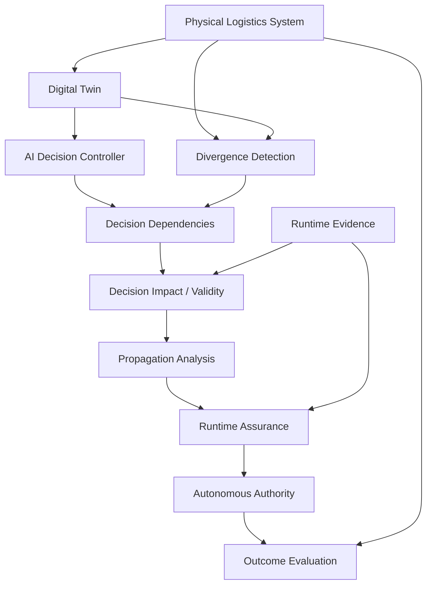

# DARA-DT

## Divergence-Aware Runtime Assurance for AI-Driven Digital Twins

> A research prototype investigating how physical–digital divergence affects
> autonomous AI decision-making in dynamic logistics Digital Twins.

---

## Research Overview

AI-driven Digital Twins increasingly support autonomous operational
decision-making.

But what happens when the Digital Twin is wrong?

A physical system can change before its Digital Twin receives the update.

For example:

```text
PHYSICAL SYSTEM                    DIGITAL TWIN

Vehicle A                          Vehicle A
status = FAILED                    status = OPERATIONAL
        │                                  │
        └──────── divergence ──────────────┘
                           │
                           ▼
                    AI Decision
                           │
                           ▼
             "Assign order to Vehicle A"
```

The AI may be behaving correctly relative to the information it receives while
still making an inappropriate decision relative to physical reality.

DARA-DT investigates the runtime-assurance problem created by this gap.

---

## Central Research Question

> **How can physical–digital divergence be quantified at runtime and used to
> regulate autonomous AI decision-making in dynamic logistics Digital Twins?**

---

## Core Idea

DARA-DT does not assume that every mismatch requires intervention.

Instead, the research progressively asks:

```text
Physical System
        │
        ▼
Digital Twin
        │
        ▼
Physical–Digital Divergence
        │
        ▼
Does the pending decision depend on it?
        │
        ▼
Decision Relevance
        │
        ▼
Does it invalidate the decision?
        │
        ▼
Decision Impact / Validity
        │
        ▼
Can the runtime evidence be trusted?
        │
        ▼
Evidence Reliability
        │
        ▼
Does the effect propagate across decisions?
        │
        ▼
Cross-Decision Dependencies
        │
        ▼
Runtime Assurance
        │
        ▼
ALLOW · RESTRICT · DEFER · FALLBACK
```

---

## Why This Matters

Consider an autonomous delivery system.

A vehicle physically breaks down, but communication delay prevents the
Digital Twin from receiving the update.

```text
Physical Vehicle
FAILED
        │
        │ delayed update
        ▼
Digital Twin
OPERATIONAL
        │
        ▼
AI Controller
        │
        ▼
Assign urgent delivery
        │
        ▼
Potentially invalid action
```

Traditional model confidence alone may not identify this problem.

The AI can be highly confident while reasoning from stale state.

DARA-DT therefore investigates assurance at the boundary between:

- physical reality;
- Digital Twin state;
- runtime evidence;
- AI decisions; and
- autonomous authority.

---

# System Architecture



The architecture deliberately separates physical ground truth from information
available to the runtime assurance mechanism.

---

# Research Model

The framework distinguishes:

```text
Physical Ground Truth
        ≠
Digital Twin State
        ≠
Runtime Evidence
        ≠
AI Decision
        ≠
Assurance Decision
```

This separation is important.

Physical ground truth is used for experimental evaluation.

It is not provided to runtime policies as privileged information.

---

# Physical–Digital Divergence

Let:

\[
P_t
\]

represent physical state and:

\[
T_t
\]

represent Digital Twin state.

Physical–digital divergence is represented conceptually as:

\[
\delta_t = P_t - T_t
\]

The research does not assume that:

\[
\delta_t \neq 0
\]

automatically means:

```text
INTERVENE
```

The significance of divergence depends on the pending decision.

---

# Decision-Relevant Divergence

For autonomous decision \(d_t\), let:

\[
Dep(d_t)
\]

represent its dependencies.

If:

\[
D_t
\]

is the set of detected divergences, decision-relevant divergence is:

\[
D_t^{rel}(d_t)
=
Dep(d_t) \cap D_t
\]

This separates:

```text
Everything wrong with the Digital Twin
```

from:

```text
What is wrong with the Digital Twin
that matters to this decision
```

---

# From Relevance to Validity

The experiments demonstrate that:

```text
Divergence
        ≠
Decision Relevance
        ≠
Decision Invalidity
```

A mismatched variable may be relevant without invalidating the decision.

DARA-DT therefore evaluates the operational impact of divergence on the
decision's requirements.

---

# Runtime Evidence

The framework represents runtime evidence as:

```text
AVAILABLE

STALE

MISSING

CONFLICTING
```

This enables experiments to distinguish:

```text
What is physically true?
```

from:

```text
What does the Twin believe?
```

and:

```text
What can the assurance mechanism reliably observe?
```

---

# Multi-Stage Divergence Propagation

The final experiment investigates whether divergence can affect downstream
decisions.

```text
Physical Divergence
        │
        ▼
Upstream Decision D1
        │
        ▼
Shared Dependency / Resource
        │
        ▼
Downstream Decision D2
        │
        ▼
Recovery Decision D3
```

The framework distinguishes:

```text
upstream divergence that propagates
```

from:

```text
upstream divergence that does not affect
the pending downstream decision
```

---

# Runtime Authority

The assurance layer can regulate autonomous authority using:

| Authority | Meaning |
|---|---|
| `ALLOW` | Permit autonomous execution |
| `RESTRICT` | Limit autonomous authority |
| `DEFER` | Delay execution until sufficient evidence is available |
| `FALLBACK` | Transfer control to an alternative safe mechanism |

Authority is evaluated separately from the underlying AI decision.

---

# Experimental Programme

The research programme contains **10 completed experiments**.

| Experiment | Research Question |
|---|---|
| EXP-001 | Can assurance distinguish relevant from irrelevant divergence? |
| EXP-002 | How do assurance policies behave as divergence varies? |
| EXP-003 | How should divergence be conditioned on decision dependencies? |
| EXP-004 | Is decision relevance sufficient when divergence severity changes? |
| EXP-005 | Does decision-impact reasoning improve intervention selectivity? |
| EXP-006 | What happens when runtime evidence is imperfect? |
| EXP-007 | Do findings generalise across dependency types? |
| EXP-008 | How does DARA-DT compare with uncertainty-aware runtime contracts? |
| EXP-009 | Does decision-relevant evidence uncertainty improve authority regulation? |
| EXP-010 | Does divergence propagation add information beyond a strong composed runtime contract? |

```text
Experimental Programme
=
10 / 10 COMPLETE
```

---

# Key Experimental Findings

The experimental progression produced several important findings.

### 1. Divergence alone is insufficient

A Digital Twin can contain mismatch unrelated to the pending decision.

Global intervention can therefore be unnecessarily conservative.

### 2. Decision relevance matters

Divergence becomes more meaningful when conditioned on the dependencies of the
pending decision.

### 3. Relevance is not validity

EXP-004 demonstrated that relevant divergence does not necessarily invalidate
the decision.

### 4. Decision impact improves selectivity

EXP-005 showed that reasoning about whether divergence changes decision
validity can reduce unnecessary intervention.

### 5. Evidence reliability matters

EXP-006–EXP-009 demonstrated the importance of separating physical truth,
Digital Twin state and runtime evidence.

### 6. Local-only assurance can be insufficient

EXP-010 demonstrated that cross-decision and cross-entity dependencies can
matter to downstream decision validity.

### 7. Strong runtime contracts remain a critical comparator

EXP-007–EXP-010 repeatedly showed that increasingly expressive runtime
contracts can reproduce important DARA-DT decision behaviour.

---

# EXP-010 — Strongest Test

EXP-010 evaluated 30 frozen conditions across:

```text
F0 — Synchronized Controls

F1 — Direct Divergence

F2 — Upstream Non-Propagating Divergence

F3 — Upstream Propagating Divergence

F4 — Compound / Cross-Entity Propagation
```

The strongest comparison was:

```text
P3
Dependency-Aware Composed Runtime Contract

            vs

P4
Propagation-Aware DARA-DT
```

Both mechanisms received equivalent observable evidence and dependency
knowledge.

---

# EXP-010 Results

| Metric | Composed Contract | DARA-DT |
|---|---:|---:|
| Conditions | 30 | 30 |
| True Interventions | 19 | 19 |
| False Interventions | 3 | 3 |
| Missed Interventions | 0 | 0 |
| Correct Non-Interventions | 8 | 8 |
| Accuracy | 0.900 | 0.900 |
| Precision | 0.864 | 0.864 |
| Recall | 1.000 | 1.000 |
| False-Intervention Rate | 0.273 | 0.273 |
| Missed-Intervention Rate | 0.000 | 0.000 |
| Autonomy Availability | 0.267 | 0.267 |

Additionally:

```text
Authority Matches
=
30 / 30

Outcome Matches
=
30 / 30
```

---

# What EXP-010 Means

The strongest differentiation hypothesis was **not supported**.

Within the frozen EXP-010 matrix:

> **Explicit divergence-propagation provenance did not provide additional
> binary intervention or authority-selection performance beyond a strong
> dependency-aware composed runtime contract receiving equivalent evidence.**

This negative result is retained as part of the research contribution.

The project does not redesign the completed experiment to manufacture a
preferred result.

---

# What the Evidence Supports

The experimental programme supports:

```text
Physical–digital divergence matters as runtime context.

Decision relevance matters.

Decision relevance alone is insufficient.

Decision validity matters.

Runtime evidence reliability matters.

Global assurance can be excessively conservative.

Local-only assurance can miss cross-dependency invalidation.

Cross-decision dependency reasoning matters.

Divergence propagation can be explicitly represented.
```

---

# What the Evidence Does Not Support

The project does **not** claim:

```text
DARA-DT universally outperforms runtime contracts.

DARA-DT outperforms the strong composed runtime contract.

DARA-DT uniquely detects divergence propagation.

DARA-DT provides universally superior authority regulation.

The prototype provides operational safety certification.

The experimental results automatically generalise to real logistics systems.
```

---

# Evidence-Supported Contribution

> **DARA-DT provides a controlled experimental framework for investigating how
> physical–digital divergence, decision dependencies, decision validity,
> runtime evidence quality and multi-stage propagation interact in runtime
> assurance for AI-driven logistics Digital Twins. Across the evaluated
> experiments, decision-sensitive dependency reasoning improves assurance
> relative to coarse global monitoring and limited local checking. However,
> when a strong dependency-aware composed runtime contract receives equivalent
> observable evidence and dependency knowledge, explicit
> divergence-propagation provenance does not provide additional binary
> intervention or authority-selection performance in the tested multi-stage
> decision structures.**

---

# Research Contribution

The project contributes an integrated experimental framework connecting:

```text
Physical Reality
        +
Digital Twin State
        +
Physical–Digital Divergence
        +
Decision Dependencies
        +
Decision Validity
        +
Runtime Evidence
        +
Cross-Decision Propagation
        +
Runtime Authority
        +
Controlled Evaluation
```

A key methodological principle is that physical ground truth remains
evaluator-only.

This avoids giving runtime assurance mechanisms information they would not
possess during real operation.

---

# Strong Comparators

DARA-DT is evaluated against progressively stronger alternatives rather than
only weak baselines.

These include:

```text
No Assurance

Global Divergence Assurance

Fixed Magnitude Assurance

Decision Relevance

Decision Impact

Runtime Contracts

Evidence-Aware Policies

Global Evidence Uncertainty

Entity-Filtered Evidence

Uncertainty-Aware Runtime Contracts

Dependency-Aware Composed Runtime Contracts
```

This comparison strategy is designed to expose rather than conceal competing
explanations.

---

# Research Integrity

The project follows a falsification-oriented workflow:

```text
Research Question
        ↓
Hypothesis
        ↓
Frozen Experimental Design
        ↓
Implementation
        ↓
Strong Comparator
        ↓
Kill Tests
        ↓
Result
        ↓
Claim Revision
```

Negative and equivalence results are preserved.

---

# Current Research Boundary

The completed experiments leave a narrower unresolved question:

> **What measurable assurance value, if any, does explicit physical–digital
> divergence provenance provide once a strong dependency-aware runtime
> contract already captures the decision-relevant operational constraints?**

Potential future dimensions include:

- root-cause localisation;
- explanation quality;
- diagnostic accuracy;
- recovery reasoning;
- auditability;
- operator understanding; and
- assurance-case evidence.

These are research opportunities, not established results.

---

# Repository Structure

```text
divergence-aware-digital-twin/
│
├── docs/
│   ├── benchmark_protocol.md
│   ├── closest_prior_work.md
│   ├── contribution_statement.md
│   ├── literature_matrix.md
│   ├── methodology.md
│   ├── novelty_evidence_matrix.md
│   ├── research_questions.md
│   ├── results.md
│   ├── system_architecture.md
│   └── experiment_*.md
│
├── src/
│   └── dara_dt/
│       ├── assurance/
│       ├── decision/
│       ├── divergence/
│       ├── evaluation/
│       ├── evidence/
│       ├── experiments/
│       ├── impact/
│       ├── propagation/
│       ├── simulation/
│       └── twin/
│
├── tests/
│
├── .github/
│   └── workflows/
│
├── pyproject.toml
│
└── README.md
```

---

# Core Implementation

The research prototype contains modules for:

| Component | Purpose |
|---|---|
| Simulation | Controlled physical logistics environment |
| Digital Twin | Computational representation of physical state |
| Decision Controller | Autonomous logistics decision generation |
| Dependency Mapping | Maps decisions to required state variables |
| Divergence Detection | Detects physical–Twin disagreement |
| Decision Relevance | Determines whether divergence affects decision dependencies |
| Decision Impact | Evaluates whether divergence affects validity |
| Runtime Evidence | Represents available, stale, missing and conflicting evidence |
| Runtime Assurance | Regulates autonomous authority |
| Propagation Analysis | Represents multi-stage divergence propagation |
| Evaluation | Compares assurance decisions against physical ground truth |

---

# Reproducibility

The project is structured so that:

```text
scenario
        ↓
physical state
        ↓
Digital Twin state
        ↓
AI decision
        ↓
divergence
        ↓
runtime evidence
        ↓
assurance policy
        ↓
authority decision
        ↓
ground-truth evaluation
        ↓
metrics
```

can be reproduced under controlled conditions.

Automated tests validate the implementation and frozen experimental
assumptions.

---

# Documentation

Detailed research documentation is available in:

- `docs/research_questions.md`
- `docs/methodology.md`
- `docs/system_architecture.md`
- `docs/benchmark_protocol.md`
- `docs/results.md`
- `docs/novelty_evidence_matrix.md`
- `docs/closest_prior_work.md`
- `docs/contribution_statement.md`

Individual experiment designs and condition matrices are also retained under
`docs/`.

---

# Current Project Status

```text
Research Question
✓

System Architecture
✓

Simulation Environment
✓

Digital Twin
✓

AI Decision Layer
✓

Divergence Detection
✓

Decision Dependency Model
✓

Decision Impact Analysis
✓

Runtime Evidence Model
✓

Runtime Assurance Policies
✓

Propagation Model
✓

EXP-001 → EXP-010
✓

Results Consolidation
✓

Novelty Audit
✓

Closest-Prior-Work Audit
✓

Contribution Freeze
✓

Research API
NEXT

Interactive Demonstrator
PLANNED

Deployment
PLANNED
```

---

# Next Stage

The next engineering stage converts the completed research prototype into an
interactive research demonstrator:

```text
Research Engine
        ↓
FastAPI Research API
        ↓
Scenario Interface
        ↓
Physical / Twin State Visualisation
        ↓
Divergence Visualisation
        ↓
AI Decision
        ↓
Assurance Comparison
        ↓
Authority Explanation
        ↓
Experimental Metrics
```

The demonstrator will expose the research process rather than hide the
negative or equivalence results.

---

# Research Direction

DARA-DT forms part of a broader research interest in:

> **Trustworthy Intelligent Systems**

with emphasis on:

```text
Artificial Intelligence

Digital Twins

Runtime Assurance

Autonomous Decision-Making

Uncertainty and Reliability

Decision Dependencies

Reinforcement Learning
```

Autonomous logistics provides the current experimental environment for
investigating these questions.

---

# Project Status

**Research prototype:** Active  
**Experimental programme:** 10 / 10 complete  
**Strongest experiment:** EXP-010  
**Strong DARA-DT superiority claim:** Not supported  
**Evidence-supported contribution:** Frozen  
**Current stage:** Research demonstrator engineering

---

## Research Principle

> **The objective is not to make an autonomous system act whenever the AI is
> confident. The objective is to determine when the evidence supporting the
> AI's view of the world is sufficient to justify autonomous authority.**
