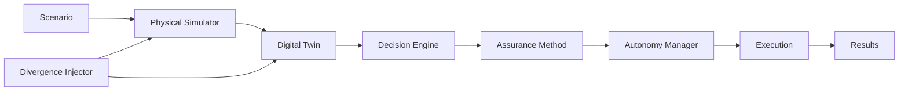

# Benchmark and Experimental Protocol

## Divergence-Aware Runtime Assurance for AI-Driven Digital Twins in Autonomous Logistics Systems

**Framework:** DARA-DT  
**Research stage:** Experimental Protocol  
**Status:** Pre-Implementation Protocol  
**Version:** 1.0  
**Last updated:** September 2026

---

## 1. Purpose

This document defines the experimental protocol for evaluating:

> **DARA-DT — Divergence-Aware Runtime Assurance for Digital Twins**

The protocol is defined before the main experimental results are produced.

Its purpose is to ensure that:

- competing assurance methods experience equivalent conditions;
- divergence is introduced systematically;
- decision relevance is independently evaluated;
- experiments are reproducible;
- unsuccessful results remain reportable;
- evaluation criteria are not changed merely because results are unfavourable.

The central experimental question is:

> **Does decision-relevant physical–digital divergence improve runtime intervention decisions compared with global Digital Twin fidelity, AI uncertainty, and runtime assumption monitoring?**

---

# 2. Experimental Hypothesis

The primary research hypothesis is:

> Runtime assurance based on whether physical–digital divergence affects the dependencies of a specific AI-generated decision can improve intervention quality compared with assurance based only on global Digital Twin divergence.

This hypothesis must be tested rather than assumed.

---

# 3. Null Hypothesis

The corresponding null hypothesis is:

> Incorporating decision-relevant divergence provides no meaningful improvement in runtime intervention quality over the selected assurance baselines.

The experiments must retain the possibility that the null hypothesis will not be rejected.

---

# 4. Experimental System

The benchmark will use the architecture defined in:

```text
docs/system_architecture.md
```

The experimental pipeline is:



The physical simulator maintains ground truth.

The Digital Twin maintains the state available to the decision system.

---

# 5. Benchmark Domain

The initial benchmark domain is:

> **Dynamic vehicle routing and dispatch under changing operational conditions.**

The environment will contain:

- vehicles;
- customer orders;
- capacities;
- locations;
- delivery deadlines;
- travel times;
- vehicle availability;
- network conditions;
- dynamic demand;
- operational disruptions.

The benchmark will initially prioritise controlled experimental validity over real-world scale.

---

# 6. Reference Operating Scenario

A reference scenario will define:

- fleet size;
- network size;
- order arrival process;
- vehicle capacities;
- order demand;
- travel-time model;
- service-time model;
- delivery deadlines;
- simulation duration.

Exact numerical values will be stored in version-controlled configuration files.

Example:

```yaml
scenario:
  name: reference_small
  seed: 42

  fleet:
    vehicles: 10

  network:
    nodes: 25

  simulation:
    duration: 480

  demand:
    dynamic: true
```

The values above are illustrative until implementation validation is complete.

---

# 7. Control Condition — D0

## D0: Synchronised Digital Twin

The Digital Twin receives correct and timely physical-system information.

Conceptually:

\[
s_t \approx \hat{s}_t
\]

D0 provides the reference condition.

It helps determine whether an assurance mechanism unnecessarily interferes when the Digital Twin is operating normally.

---

# 8. Temporal Divergence — D1

D1 introduces stale or delayed information.

Candidate stressors include:

- GPS delay;
- telemetry delay;
- delayed vehicle-status update;
- delayed order-status update;
- delayed network-state update.

Example:

```yaml
divergence:
  id: D1
  type: temporal
  target: vehicle.location
  delay: 20
```

Severity levels will be defined before final experiments.

---

# 9. State Divergence — D2

D2 introduces incorrect state information.

Candidate examples include:

- incorrect location;
- incorrect vehicle capacity;
- incorrect availability;
- incorrect order status;
- incorrect inventory or resource state.

Example:

```text
Physical:
vehicle_07.capacity_remaining = 10

Twin:
vehicle_07.capacity_remaining = 40
```

---

# 10. Operational Divergence — D3

D3 represents operational events that are not correctly reflected in the Digital Twin.

Candidate events include:

- vehicle breakdown;
- route closure;
- unavailable vehicle;
- infrastructure failure;
- resource outage.

Example:

```text
Physical:
vehicle_07.status = BROKEN_DOWN

Twin:
vehicle_07.status = OPERATIONAL
```

---

# 11. Distributional Divergence — D4

D4 introduces operating conditions different from the nominal experimental distribution.

Candidate stressors include:

- demand surge;
- unusual congestion;
- extreme order density;
- atypical travel-time patterns;
- unusual resource utilisation.

The purpose is to test whether assurance remains useful when operational conditions shift.

---

# 12. Compound Divergence — D5

D5 combines multiple divergence mechanisms.

Examples include:

```text
Temporal + Operational

State + Distributional

Temporal + State + Operational

Operational + Distributional
```

Compound scenarios test whether assurance remains effective when divergence mechanisms interact.

---

# 13. Divergence Severity

Where applicable, divergence will be tested at multiple severity levels.

The initial conceptual levels are:

```text
LOW
MEDIUM
HIGH
```

Severity will be defined using measurable parameters rather than subjective labels.

Examples include:

- delay duration;
- state-error magnitude;
- number of affected entities;
- number of affected variables;
- duration of disruption.

Final thresholds will be fixed in configuration before confirmatory experiments.

---

# 14. Decision Relevance

Divergence magnitude and decision relevance must be treated as separate experimental dimensions.

For proposed decision:

\[
d_t
\]

let:

\[
Dep(d_t)
\]

represent its state dependencies.

Let:

\[
D_t
\]

represent detected divergent variables.

Decision-relevant divergence is:

\[
D_t^{rel}(d_t)
=
D_t \cap Dep(d_t)
\]

This relationship forms the central experimental construct.

---

# 15. Core 2 × 2 Experiment

The central benchmark separates:

1. global divergence magnitude; and
2. decision relevance.

| Condition | Global Divergence | Decision Relevance |
|---|---:|---:|
| **A** | Low | Low |
| **B** | High | Low |
| **C** | Low | High |
| **D** | High | High |

---

## Condition A

### Low Divergence — Low Relevance

The Twin is largely synchronised and any discrepancy is unrelated to the current decision.

Expected challenge:

> Avoid unnecessary intervention.

---

## Condition B

### High Divergence — Low Relevance

Substantial divergence exists elsewhere in the Digital Twin, but it does not affect the state dependencies of the proposed decision.

Expected challenge:

> Avoid overreacting to globally poor Twin fidelity.

---

## Condition C

### Low Divergence — High Relevance

The Twin is largely accurate overall, but a small discrepancy affects information required by the proposed decision.

Expected challenge:

> Detect locally critical divergence despite good global fidelity.

---

## Condition D

### High Divergence — High Relevance

Substantial divergence exists and affects the proposed decision.

Expected challenge:

> Correctly intervene under clearly degraded conditions.

---

# 16. Critical B-versus-C Test

The most important contrast is:

\[
\boxed{B \; vs \; C}
\]

Consider:

### B

```text
Large Twin error:
vehicle_03.location incorrect

Decision:
assign vehicle_07 to order_42
```

versus:

### C

```text
Small Twin error:
vehicle_07.status incorrect

Physical:
BROKEN_DOWN

Twin:
AVAILABLE

Decision:
assign vehicle_07 to order_42
```

A global-fidelity method may regard B as more problematic.

A decision-relevance mechanism should recognise that C may have greater consequence for the specific decision.

This experiment directly tests the proposed research distinction.

---

# 17. Assurance Baselines

The following strategies are candidate benchmark methods.

| ID | Method |
|---|---|
| **B0** | No runtime assurance |
| **B1** | Fixed divergence threshold |
| **B2** | Global Digital Twin fidelity |
| **B3** | AI confidence / uncertainty |
| **B4** | Operational-envelope monitoring |
| **B5** | Runtime assumption monitoring |
| **B6** | Global fidelity + AI uncertainty |
| **B7** | DARA-DT decision-relevant divergence |

B5 is particularly important because runtime assumption monitoring represents a strong conceptual competitor to the proposed approach.

---

# 18. Fair Baseline Comparison

All assurance strategies must receive equivalent:

- scenarios;
- controller outputs;
- divergence events;
- random seeds;
- timing conditions;
- evaluation windows.

Where possible, the same underlying simulated trajectory will be used for paired comparisons.

Thresholds must not be tuned using final test scenarios.

---

# 19. Controller Baselines

The assurance experiment should not depend entirely on one decision algorithm.

The implementation will begin with:

### Controller C0

Simple heuristic controller.

### Controller C1

Classical optimisation using OR-Tools.

A learned controller may later be introduced as:

### Controller C2

AI / learned policy.

C2 will only be added when it contributes to the research question rather than merely increasing system complexity.

---

# 20. Ground-Truth Intervention Label

For every evaluated decision, the benchmark should determine whether intervention was actually required.

The ground-truth label will be derived using information unavailable to the operational decision engine.

Conceptually:

\[
y_t =
\begin{cases}
1 & \text{if intervention is required}\\
0 & \text{otherwise}
\end{cases}
\]

The criteria used to construct this label must be documented before final evaluation.

Examples may include:

- decision infeasible under physical ground truth;
- required vehicle physically unavailable;
- physical capacity constraint violated;
- required route physically inaccessible;
- deadline feasibility invalidated by true conditions.

The label must not be generated using the proposed DARA-DT score itself.

---

# 21. Assurance Decision

Each assurance method produces:

\[
\hat{y}_t
\]

where:

\[
\hat{y}_t =
\begin{cases}
1 & \text{intervene}\\
0 & \text{allow autonomous execution}
\end{cases}
\]

Comparison between:

\[
y_t
\]

and:

\[
\hat{y}_t
\]

allows intervention performance to be measured.

---

# 22. Intervention Confusion Matrix

| Ground Truth | Assurance Decision | Outcome |
|---|---|---|
| Intervention required | Intervene | True Positive |
| Intervention not required | Intervene | False Positive |
| Intervention required | Do not intervene | False Negative |
| Intervention not required | Do not intervene | True Negative |

This supports measurement of both:

- missed interventions; and
- unnecessary interventions.

Both are important.

---

# 23. Primary Assurance Metrics

Primary metrics will include:

### Precision

\[
Precision =
\frac{TP}{TP+FP}
\]

### Recall

\[
Recall =
\frac{TP}{TP+FN}
\]

### F1 Score

\[
F1 =
2
\frac{Precision \times Recall}
{Precision + Recall}
\]

Additional primary outcomes include:

- false intervention rate;
- missed intervention rate;
- inappropriate-action prevention rate;
- intervention latency.

Where risk scores are probabilistic, discrimination and calibration metrics may also be evaluated.

---

# 24. Autonomy Availability

A runtime-assurance system should not obtain high protection simply by disabling autonomy.

Define:

\[
AutonomyAvailability =
\frac{\text{Autonomously executed eligible decisions}}
{\text{Total eligible decisions}}
\]

This metric will be reported alongside assurance effectiveness.

---

# 25. Logistics Performance

Candidate logistics outcomes include:

- delivery success rate;
- average lateness;
- total travel distance;
- logistics cost;
- vehicle utilisation;
- rejected orders;
- recovery time following disruption.

The exact metric set will be frozen before confirmatory experiments.

---

# 26. Runtime Performance

The assurance mechanism must also be computationally practical.

Candidate measurements include:

- decision-generation latency;
- assurance latency;
- total decision latency;
- memory overhead;
- CPU overhead where relevant.

---

# 27. Primary Evaluation Trade-Off

Results must be interpreted across three dimensions:

\[
\boxed{
\text{Assurance Effectiveness}
\leftrightarrow
\text{Autonomy Availability}
\leftrightarrow
\text{Logistics Performance}
}
\]

No method should be declared superior using only one favourable metric.

---

# 28. Experimental Matrix

The full experimental design will progressively combine:

```text
Divergence Type
        ×
Divergence Severity
        ×
Decision Relevance
        ×
Assurance Method
        ×
Controller
        ×
Scenario
        ×
Random Seed
```

This will be implemented through configuration rather than manually duplicated scripts.

---

# 29. Random Seeds and Replication

Experiments will use recorded random seeds.

Example configuration:

```yaml
seeds:
  - 11
  - 23
  - 37
  - 51
  - 73
```

These values are illustrative.

The final number of replications will be determined using pilot variance, statistical power, or a predefined precision criterion.

The number of repetitions will not be increased or decreased simply to obtain statistical significance.

---

# 30. Pilot and Confirmatory Experiments

Experiments will be separated into two stages.

## Stage 1 — Pilot

Used to:

- debug the simulator;
- validate metrics;
- estimate variance;
- identify implementation errors;
- select reasonable parameter ranges.

Pilot results are exploratory.

---

## Stage 2 — Confirmatory Benchmark

Used for final comparisons.

Before confirmatory experiments:

- scenarios are frozen;
- primary metrics are frozen;
- baseline definitions are frozen;
- principal hypotheses are frozen;
- analysis procedures are documented.

This reduces researcher degrees of freedom.

---

# 31. Threshold Tuning

Any method requiring thresholds must use separate tuning scenarios.

The final benchmark scenarios must not be used to select:

- divergence thresholds;
- uncertainty thresholds;
- risk thresholds;
- authority thresholds.

The intended split is:

```text
Development / Pilot
        ↓
Threshold Tuning
        ↓
Held-Out Benchmark
```

This reduces evaluation leakage.

---

# 32. Ablation Experiments

The full proposed method will be compared against reduced variants.

Candidate ablations include:

```text
A0 — Full DARA-DT

A1 — Without decision dependencies

A2 — Without AI uncertainty

A3 — Without operational consequence

A4 — Without temporal evidence

A5 — Without distributional evidence

A6 — Without compound-divergence handling
```

The most important ablation is:

\[
\boxed{
\text{Full DARA-DT}
\quad vs \quad
\text{DARA-DT without Decision Relevance}
}
\]

If this comparison produces no meaningful difference, the central research proposition would be weakened.

---

# 33. Sensitivity Analysis

Sensitivity analysis will examine whether conclusions depend excessively on specific:

- thresholds;
- divergence magnitudes;
- scenario sizes;
- demand rates;
- disruption durations;
- dependency weights;
- controller configurations.

A robust result should not exist only under one narrowly selected parameter configuration.

---

# 34. Statistical Analysis

Comparisons will use paired experimental observations where possible.

Analysis will report:

- central tendency;
- dispersion;
- confidence intervals;
- effect sizes.

Depending on outcome type and distribution, appropriate analyses may include:

- paired bootstrap confidence intervals;
- paired parametric tests where assumptions are satisfied;
- non-parametric paired tests where appropriate;
- regression or mixed-effects models for repeated scenario measurements;
- generalized models for binary intervention outcomes.

Where many comparisons are performed, appropriate multiple-comparison control will be considered.

Exact statistical tests will be selected after pilot data reveal the measurement distributions, but before confirmatory analysis.

---

# 35. Reporting Negative Results

The following outcomes are valid research findings:

```text
DARA-DT improves intervention quality.

DARA-DT performs similarly to existing methods.

DARA-DT performs worse than existing methods.

Decision relevance only helps under certain divergence conditions.

Runtime overhead outweighs the assurance benefit.

Runtime assumption monitoring already captures most of the proposed benefit.
```

Negative findings will not be removed from the experimental record.

---

# 36. Falsification Criteria

The proposed research contribution will be substantially weakened if:

1. decision relevance provides no measurable benefit over global fidelity;
2. it provides no meaningful benefit over runtime assumption monitoring;
3. improvement occurs only by heavily suppressing autonomy;
4. logistics performance deteriorates substantially;
5. improvements disappear under held-out scenarios;
6. benefits occur only under artificially favourable divergence conditions;
7. runtime overhead makes the approach operationally impractical.

These outcomes will trigger refinement or rejection rather than retrospective modification of the hypothesis.

---

# 37. Novelty Kill Test

The benchmark also supports the project's novelty assessment.

The proposed contribution becomes difficult to defend as distinct if prior work already demonstrates, in dynamic logistics:

```text
Physical–Digital Divergence
        +
Explicit Decision Dependency Mapping
        +
Runtime Dependency Validation
        +
Decision-Level Risk
        +
Runtime Intervention
        +
Adaptive Authority
        +
Controlled Compound Divergence
        +
Equivalent Experimental Evaluation
```

If such work is identified, the project must be refined before novelty is claimed.

---

# 38. Reproducibility Record

Every benchmark run should generate a manifest containing:

```yaml
experiment_id:
timestamp:
git_commit:
seed:
scenario:
controller:
divergence_type:
divergence_severity:
assurance_method:
configuration_version:
```

The corresponding raw results should remain immutable.

Derived figures and tables should be generated from those raw results using scripts.

---

# 39. Proposed Result Structure

Experimental results will eventually be organised as:

```text
results/
│
├── raw/
│
├── processed/
│
├── figures/
│
├── tables/
└── manifests/
```

Generated results should not be manually edited.

---

# 40. Minimum Experiment Sequence

Implementation will not begin with the full benchmark matrix.

Experiments will progressively increase in complexity.

### EXP-001 — Synchronised Baseline

```text
D0
No divergence
```

Purpose:

Validate normal simulation and decision behaviour.

---

### EXP-002 — Single State Divergence

```text
D2
Single vehicle-state error
```

Purpose:

Validate divergence injection and detection.

---

### EXP-003 — Decision-Relevance Test

```text
Relevant
vs
Irrelevant divergence
```

Purpose:

Validate dependency matching.

---

### EXP-004 — B-versus-C Experiment

```text
High divergence / Low relevance

vs

Low divergence / High relevance
```

Purpose:

Test the central research distinction.

---

### EXP-005 — Assurance Baseline Comparison

Compare:

```text
Global Fidelity
vs
Assumption Monitoring
vs
DARA-DT
```

Purpose:

Determine whether decision relevance adds measurable value.

---

### EXP-006 — Compound Divergence

```text
D5
```

Purpose:

Evaluate performance under interacting divergence mechanisms.

---

### EXP-007 — Full Benchmark

Run the frozen benchmark matrix across:

- scenarios;
- seeds;
- divergence types;
- severity levels;
- assurance methods.

---

# 41. Minimum Evidence Required

Before making a claim that DARA-DT improves runtime assurance, evidence should include:

1. reproducible benchmark configurations;
2. comparison against credible baselines;
3. multiple experimental repetitions;
4. decision-relevant and irrelevant divergence;
5. B-versus-C evaluation;
6. assurance metrics;
7. autonomy-availability metrics;
8. logistics-performance metrics;
9. runtime-overhead measurements;
10. uncertainty estimates or confidence intervals;
11. ablation evidence;
12. documented negative results.

---

# 42. Claim Discipline

The following statement is currently acceptable:

> **This project investigates whether decision-relevant physical–digital divergence can improve runtime assurance for AI-driven logistics Digital Twins.**

Before experiments, the following statement is **not** acceptable:

> DARA-DT improves autonomous logistics safety and reliability.

After experimentation, claims must match the actual evidence.

---

# 43. Benchmark Freeze Rule

Once confirmatory experiments begin, the following must not be changed without creating a new protocol version:

- primary hypothesis;
- primary outcomes;
- benchmark scenarios;
- baseline definitions;
- ground-truth intervention criteria;
- test-set thresholds;
- principal statistical comparisons.

If a change becomes necessary, it must be:

1. documented;
2. justified;
3. versioned;
4. distinguished from the original confirmatory protocol.

---

# 44. Protocol Versioning

Protocol changes will use explicit versions.

Example:

```text
v1.0 — Initial pre-implementation protocol

v1.1 — Clarification before confirmatory testing

v2.0 — Material experimental redesign
```

Git history will provide an additional audit trail.

---

# 45. Benchmark Status

| Component | Status |
|---|---|
| Research hypothesis | Defined |
| Null hypothesis | Defined |
| Benchmark domain | Defined |
| D0–D5 framework | Defined |
| Decision relevance | Defined conceptually |
| B-versus-C test | Defined |
| Assurance baselines | Defined |
| Ground-truth strategy | Defined conceptually |
| Metrics | Defined |
| Ablations | Defined |
| Statistical strategy | Defined |
| Falsification criteria | Defined |
| Reproducibility requirements | Defined |
| Pilot experiments | Not started |
| Confirmatory experiments | Not started |
| Results | None claimed |

---

# 46. Pre-Implementation Gate

Before implementation begins, the project should have:

```text
Research Gap
      ✓

Literature Matrix
      ✓

Novelty Evidence Matrix
      ✓

Closest Prior Work
      ✓

Research Questions
      ✓

Methodology
      ✓

System Architecture
      ✓

Benchmark Protocol
      ✓
```

Once these documents are internally consistent, implementation can begin.

---

# 47. Next Stage — Implementation

The next stage is:

> **Phase 1 — Reproducible Research Environment and Logistics Simulator**

The implementation will begin with:

```text
pyproject.toml
        ↓
uv environment
        ↓
src/dara_dt/
        ↓
tests/
        ↓
configuration system
        ↓
minimal logistics simulator
        ↓
EXP-001 synchronised baseline
```

The first implementation objective is **not DARA-DT itself**.

The first objective is to establish a tested, deterministic logistics simulation capable of generating trustworthy ground truth.

Only after that foundation is validated will the Digital Twin and divergence mechanisms be introduced.

---

## Research Integrity Note

This protocol is designed to make the proposed research contribution **falsifiable**.

DARA-DT is not assumed to outperform existing runtime-assurance approaches.

The benchmark must be capable of demonstrating superiority, equivalence, conditional usefulness, or failure.

Any eventual research claim must follow from the experimental evidence rather than from the intended architecture.
