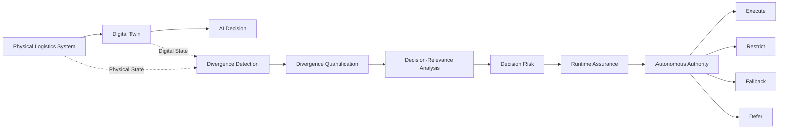
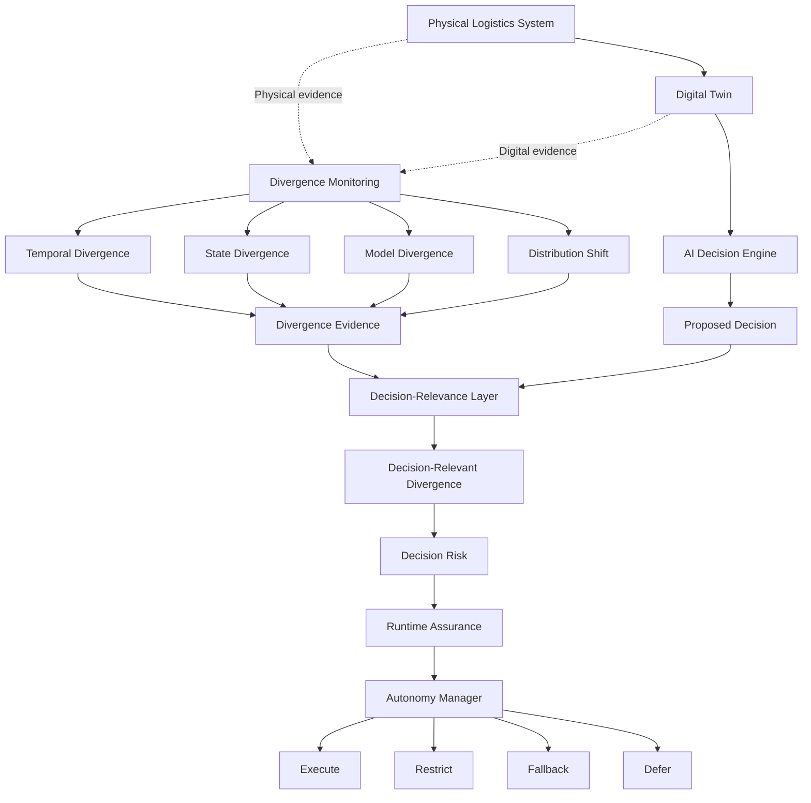
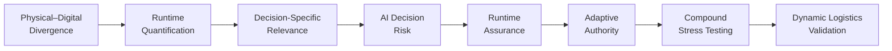
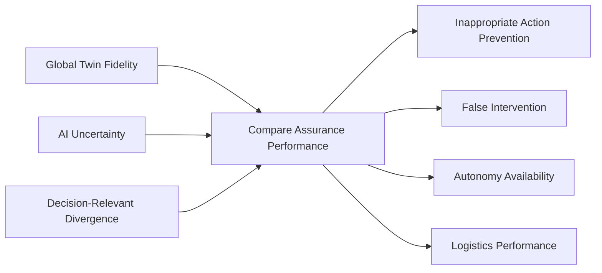

# Literature Evidence Matrix

## Divergence-Aware Runtime Assurance for AI-Driven Digital Twins in Autonomous Logistics Systems

**Document type:** Structured Literature Evidence Register
**Research stage:** Research-Gap and Novelty Validation
**Status:** Living Research Document
**Last updated:** September 2026

---

# 1. Purpose

This document systematically evaluates the literature surrounding the proposed research:

> **Divergence-Aware Runtime Assurance for AI-Driven Digital Twins in Autonomous Logistics Systems**

The purpose of this review is not to collect publications that merely support the proposed research idea.

Instead, the review deliberately searches for prior work capable of **challenging or invalidating the proposed novelty claim**.

The central novelty question is:

> **Does existing research already provide a systematic method for determining whether physical–digital divergence is relevant to a particular AI-generated logistics decision and using that evidence to regulate autonomous execution at runtime?**

If sufficiently strong prior research already provides this capability, the proposed contribution will be narrowed, reformulated, or rejected before substantial implementation begins.

This approach treats novelty as a conclusion derived from evidence rather than an assumption made at the beginning of the project.

---

# 2. Current Research Proposition

The proposed research investigates the following relationship:

$$
\boxed{
\text{Physical–Digital Divergence}
\rightarrow
\text{Decision Relevance}
\rightarrow
\text{Decision Risk}
\rightarrow
\text{Runtime Assurance}
\rightarrow
\text{Autonomous Authority}
}
$$

The central proposition is that **raw Digital Twin fidelity alone may be insufficient for runtime decision assurance**.

A divergence may need to be interpreted relative to:

1. the AI decision being proposed;
2. the state variables upon which that decision depends;
3. uncertainty surrounding the decision;
4. the operational context; and
5. the potential consequence of executing an inappropriate decision.

This motivates the concept of **decision-relevant divergence**.

### Working Definition

> **Decision-relevant divergence is a physical–digital mismatch whose existence or magnitude materially affects the validity, risk, or expected outcome of a particular AI-generated decision.**

This definition remains provisional and will be refined through literature analysis and experimentation.

---

## 2.1 Research Logic at a Glance

The proposed research follows a progression from physical–digital inconsistency to evidence-informed autonomous control.



The Digital Twin provides the AI system with a digital representation of the logistics environment from which operational decisions can be generated.

The assurance process examines evidence concerning the physical and digital states, identifies divergence, and evaluates whether that divergence matters to the particular decision currently being considered.

The central research interest is therefore:

> **Divergence → Decision Relevance → Decision Risk → Runtime Assurance → Autonomous Authority**

This distinction is important because the proposed investigation is not simply concerned with global Digital Twin fidelity, AI uncertainty, or system synchronisation.

---

# 3. Literature Review Questions

The literature review addresses six questions.

### LRQ1 — Divergence

How does existing Digital Twin research define, detect, quantify, or manage divergence between physical and digital states?

### LRQ2 — Decision Reliability

What evidence exists concerning the relationship between Digital Twin fidelity and the reliability of decisions generated from the twin?

### LRQ3 — Runtime Assurance

Which existing approaches provide continuous or runtime assurance for AI-enabled Digital Twins?

### LRQ4 — Decision Relevance

Do existing approaches determine whether an observed divergence affects the validity of a **specific proposed decision**?

### LRQ5 — Autonomous Authority

Do existing systems use assurance evidence to dynamically permit, restrict, modify, defer, or reject autonomous actions?

### LRQ6 — Logistics Validation

Have these capabilities been evaluated systematically under dynamic and compound logistics disruptions?

---

# 4. Review Method

## 4.1 Search Scope

The review prioritises research published between **2020 and September 2026**, while retaining earlier foundational literature where necessary.

Priority evidence sources include:

* peer-reviewed journal articles;
* systematic literature reviews;
* peer-reviewed conference proceedings;
* recognised standards and recommended practices;
* UK Government Digital Twin guidance;
* major institutional research programmes;
* authoritative technical frameworks.

The review should eventually search major scholarly databases such as:

* Scopus;
* Web of Science;
* IEEE Xplore;
* ACM Digital Library;
* ScienceDirect;
* SpringerLink.

Google Scholar may additionally be used for citation discovery.

---

## 4.2 Search Concepts

Search strategies combine Digital Twin terminology with concepts relating to logistics, assurance, divergence, autonomy, and decision-making.

Example search strings include:

```text
"digital twin" AND logistics

"digital twin" AND "runtime assurance"

"digital twin" AND divergence

"digital twin" AND fidelity

"digital twin" AND synchronisation

"digital twin" AND "autonomous decision"

"digital twin" AND "decision authority"

"digital twin" AND uncertainty

"digital twin" AND validation

"digital twin" AND "distribution shift"

"digital twin" AND "operational envelope"

"digital twin" AND "decision relevance"

"digital twin" AND "physical-digital divergence"
```

Backward and forward citation searching should be conducted for highly relevant publications.

---

# 5. Evidence Hierarchy

Sources are classified according to their role in the evidence base.

| Code   | Evidence Type                                   | Primary Purpose                                                     |
| ------ | ----------------------------------------------- | ------------------------------------------------------------------- |
| **SR** | Systematic Review                               | Establish the broader state of the research field                   |
| **PS** | Primary Empirical Study                         | Evaluate a specific method, system, or experiment                   |
| **ST** | Standard / Government / Institutional Framework | Establish definitions, assurance requirements, or accepted practice |
| **CF** | Conceptual / Framework Study                    | Establish theoretical or architectural approaches                   |

Systematic reviews and authoritative standards provide evidence concerning the research landscape.

Primary empirical studies are required when evaluating specific technical capabilities.

---

# 6. Core Evidence Base

## ST01 — UK Government Digital Twin Definition

**Organisation:** UK Government / Defence Science and Technology Laboratory
**Year:** 2025
**Evidence type:** ST

### Contribution

The UK Digital Twin definition establishes that a Digital Twin should:

* correspond to a real-world counterpart;
* operate to a known tolerance;
* possess a defined validation envelope;
* have an associated assumption set;
* operate within a timeframe appropriate to the required decisions; and
* maintain appropriate physical–digital information exchange.

### Relevance

This evidence prevents the project from claiming that:

> “A Digital Twin should be checked to determine whether it still represents reality”

as a novel contribution.

Fidelity, validation boundaries, assumptions, and physical–digital correspondence are already fundamental Digital Twin concepts.

### Remaining Research Question

The proposed research asks a narrower question:

> **If some part of the Digital Twin diverges from reality, does that particular divergence invalidate the specific AI-generated decision currently being considered?**

---

## ST02 — DARTER: Digital Twin Assurance via Runtime Trust and Evidence Reporting

**Organisation:** The Alan Turing Institute
**Year:** 2026
**Evidence type:** ST / Active Research Programme

### Contribution

DARTER investigates continuous runtime assurance for probabilistic AI-enabled Digital Twins.

Relevant capabilities include:

* incoming-data verification;
* model-performance evaluation;
* validated-threshold monitoring;
* operational-domain monitoring;
* distribution-drift detection;
* structured runtime assurance evidence; and
* continuously updated assurance cases.

### Relevance

DARTER substantially overlaps with the runtime-assurance component of this project.

Therefore:

> **Runtime assurance for AI-enabled Digital Twins cannot itself constitute the novelty of this research.**

### Remaining Question

The proposed project investigates whether divergence evidence can additionally be evaluated relative to the **state dependencies and operational consequences of a particular autonomous logistics decision**.

This distinction must be validated against the wider literature rather than assumed.

---

## SR01 — Digital Twins for Real-Time Decision-Making in Supply Chain Management and Logistics

**Authors:** Tolia, A. & Ponis, S. T.
**Year:** 2026
**Journal:** *Information*, 17(8), 732
**Evidence type:** SR
**Studies synthesised:** 57

### Contribution

The review systematically analyses Digital Twins used for real-time decision-making in supply chain management and logistics.

Reported applications include:

* production scheduling and planning;
* routing and dispatch;
* resource allocation;
* disruption management;
* inventory management.

The literature frequently combines:

* simulation;
* optimisation;
* machine learning;
* real-time data acquisition.

### Relevance

This demonstrates that:

> **Real-time Digital Twin decision-making in logistics is already a substantial research area.**

Consequently, simply combining:

```text
Digital Twin
      +
Artificial Intelligence
      +
Real-Time Logistics
```

does not constitute a sufficient research contribution.

### Research Opportunity

The review identifies continuing challenges involving areas such as:

* validation;
* computational efficiency;
* interoperability;
* data;
* methodological integration; and
* systemic implementation.

The temporal relationship between data refresh, decision generation, and physical-system evolution is particularly relevant to this research.

---

# 7. Capability-Based Literature Matrix

The following matrix provides the main mechanism for evaluating the candidate research gap.

### Legend

* **✓** = explicitly addressed
* **△** = partially addressed
* **—** = not established from current evidence
* **?** = requires deeper full-text verification

| ID                              | Divergence / Fidelity | Runtime Detection | Quantification | Decision Relevance | AI Uncertainty | Decision Risk | Runtime Intervention | Adaptive Authority | Compound Stress | Logistics Validation |
| ------------------------------- | --------------------: | ----------------: | -------------: | -----------------: | -------------: | ------------: | -------------------: | -----------------: | --------------: | -------------------: |
| ST01 UK DT Definition           |                     ✓ |                 △ |              △ |                  △ |              — |             △ |                    △ |                  — |               — |                    — |
| ST02 DARTER                     |                     ✓ |                 ✓ |              ✓ |                  △ |              ✓ |             △ |                    ✓ |                  ? |               △ |                    △ |
| SR01 Tolia & Ponis              |                     ✓ |                 ✓ |              △ |                  △ |              △ |             △ |                    △ |                  △ |               △ |                    ✓ |
| PS01 Adaptive Synchronisation   |                     ✓ |                 ✓ |              ✓ |                  — |              ✓ |             — |                    ✓ |                  — |               △ |                    — |
| PS02 DT Fidelity Measurement    |                     ✓ |                 ✓ |              ✓ |                  — |              △ |             — |                    △ |                  — |               — |                    △ |
| PS03 Autonomous Logistics DT    |                     △ |                 ✓ |              △ |                  △ |              △ |             △ |                    ✓ |                  ✓ |               △ |                    ✓ |
| PS04 Adaptive Logistics Control |                     △ |                 ✓ |              △ |                  △ |              — |             △ |                    ✓ |                  ✓ |               △ |                    ✓ |

> **Research integrity note:** Entries marked `?` or `△` must be verified against the complete publication before they are used to support a final novelty claim.

---

# 8. What Existing Research Already Covers

The evidence currently prevents this project from presenting the following concepts as standalone novelty.

## 8.1 Digital Twin Fidelity

Methods for measuring correspondence between physical and digital systems already exist.

## 8.2 Physical–Digital Synchronisation

Maintaining synchronisation is an established Digital Twin problem.

## 8.3 Divergence Detection

Detecting differences between expected, digital, and observed physical states is already an active research area.

## 8.4 Runtime Assurance

Continuous assurance for AI-enabled Digital Twins is an active research direction.

## 8.5 Distribution-Shift Detection

Monitoring whether operational conditions move outside validated conditions is established within AI and Digital Twin research.

## 8.6 AI-Enabled Logistics Digital Twins

AI, optimisation, simulation, and real-time data are already integrated into logistics Digital Twin systems.

## 8.7 Adaptive Logistics Decisions

Dynamic routing, scheduling, dispatch, resource allocation, and disruption response are established research areas.

Therefore, the proposed contribution cannot simply be:

> **“An AI-powered Digital Twin that detects divergence and makes adaptive logistics decisions.”**

Such a formulation would be insufficiently differentiated from existing research.

---

# 9. Candidate Research Gap: Decision-Relevant Divergence

The more specific candidate gap concerns the relationship between **physical–digital divergence and the decision currently being considered**.

Consider the following example.

### Physical System

```text
Vehicle 7

Status = BROKEN DOWN
Load = 42%
```

### Digital Twin

```text
Vehicle 7

Status = AVAILABLE
Load = 40%
```

Two divergences exist:

$$
D_1 = \text{Vehicle availability mismatch}
$$

and:

$$
D_2 = \text{Vehicle load mismatch}
$$

Now consider the AI-generated decision:

> **Assign Vehicle 7 to an urgent delivery.**

For this decision, the availability mismatch may completely invalidate execution.

The small load mismatch may have little operational significance.

Conceptually:

$$
Rel(D_1,d_t) \gg Rel(D_2,d_t)
$$

Therefore:

$$
\boxed{
\text{Raw Divergence}
\neq
\text{Decision-Relevant Divergence}
}
$$

This distinction is central to the proposed research.

---

# 10. Proposed Analytical Model

Let the AI propose decision:

$$
d_t
$$

based on the Digital Twin state:

$$
\hat{s}_t
$$

while the corresponding physical-system state is:

$$
s_t
$$

Physical–digital divergence can initially be represented conceptually as:

$$
D_t = \Delta(s_t,\hat{s}_t)
$$

However, the proposed research does not assume that \(D_t\) alone adequately represents decision risk.

Instead, decision-relevant divergence may be represented conceptually as:

$$
D_t^{rel}(d_t)
=
g(D_t, Dep(d_t), C_t)
$$

where:

* \(D_t^{rel}(d_t)\) = decision-relevant divergence;
* \(Dep(d_t)\) = state dependencies of decision \(d_t\);
* \(C_t\) = operational context.

Decision risk may subsequently be investigated as:

$$
R(d_t)
=
f(
D_t^{rel},
U_t,
I_t
)
$$

where:

* \(U_t\) = uncertainty associated with the AI decision;
* \(I_t\) = estimated operational consequence if the decision is inappropriate.

Runtime authority can then be represented conceptually as:

$$
A_t = \pi(R(d_t),E_t)
$$

where:

* \(A_t\) = permitted autonomous authority;
* \(E_t\) = additional assurance evidence.

Potential authority states include:

```text
EXECUTE
   ↓
RESTRICT
   ↓
FALLBACK
   ↓
DEFER
```

These equations represent **research hypotheses and conceptual relationships**, not validated mathematical models.

---

# 11. Refined Research Architecture

The proposed research architecture is:



The **Decision-Relevance Layer** is currently the most important candidate differentiator.

Its purpose is not merely to ask:

> “How different is the Digital Twin from reality?”

Instead, it asks:

> **“Is the Digital Twin wrong about something that matters to this particular decision?”**

---

# 12. Core Scientific Comparison

The proposed research should ultimately compare three different assurance philosophies.

## Baseline A — Global Twin Fidelity

> **How different is the Digital Twin from reality?**

This approach focuses primarily on overall physical–digital correspondence.

---

## Baseline B — AI Uncertainty

> **How uncertain is the AI about its decision?**

This approach focuses primarily on model confidence or uncertainty.

---

## Proposed Investigation — Decision-Relevant Divergence

> **Is the Digital Twin wrong about something that materially affects this particular AI decision?**

This comparison provides a clearer experimental basis for determining whether decision-relevant divergence provides information beyond existing fidelity and uncertainty approaches.

---

# 13. Compound Divergence

Real logistics systems may experience multiple simultaneous sources of divergence.

For example:

```text
GPS latency
     +
Vehicle breakdown
     +
Demand surge
     +
Traffic disruption
```

The research should therefore evaluate both isolated and compound divergence.

The benchmark can progress conceptually through:

$$
D_0 = \text{Synchronised Operation}
$$

$$
D_1 = \text{Single Divergence}
$$

$$
D_2 = \text{Multiple Divergence}
$$

$$
D_n = \text{Compound / Severe Divergence}
$$

This is important because individually tolerable discrepancies may interact and create substantially greater decision risk.

---

# 14. Novelty Kill Test

The project should not protect its proposed contribution from contradictory evidence.

Instead, the literature search must actively attempt to identify research covering the entire proposed capability chain.



A credible existing study covering all or most of this chain would represent a serious challenge to the proposed contribution.

The research question should then be narrowed, reformulated, or replaced.

Finding such evidence should be treated as a successful research outcome because it prevents an unsupported novelty claim.

---

# 15. Experimental Gap Test

The literature gap will eventually be translated into an experimental comparison.

The project should test whether:

$$
\text{Decision-Relevant Divergence Assurance}
$$

provides measurable information or performance beyond:

$$
\text{Global Fidelity Monitoring}
$$

and:

$$
\text{AI Uncertainty Monitoring}
$$

under controlled logistics disruptions.

The critical comparison therefore becomes:



This comparison will help determine whether the proposed concept contributes useful information rather than merely adding additional system complexity.

---

# 16. Candidate Experimental Stressors

The experimental environment should eventually introduce controlled divergence.

## Temporal Divergence

Examples:

* GPS latency;
* stale observations;
* communication delay;
* delayed warehouse updates.

## State Divergence

Examples:

* incorrect vehicle location;
* incorrect capacity;
* incorrect availability;
* incorrect inventory.

## Operational Divergence

Examples:

* unreported vehicle breakdown;
* route closure;
* resource failure.

## Distributional Divergence

Examples:

* demand surge;
* extreme congestion;
* previously unseen operating conditions.

## Compound Divergence

Multiple divergence mechanisms occurring simultaneously.

Because divergence will be deliberately injected, the experiments can retain ground truth concerning:

* when divergence occurred;
* what state variables were affected;
* which decisions depended upon those variables;
* whether intervention was appropriate.

---

# 17. Evidence Required Before Novelty Can Be Claimed

The proposed research gap will not be treated as established until the following work has been completed:

* expanded scholarly database searching;
* backward citation searching;
* forward citation searching;
* full-text verification of the closest studies;
* explicit capability coding;
* comparison with runtime-assurance literature outside logistics;
* comparison with autonomous-system assurance literature;
* comparison with decision-aware Digital Twin research;
* comparison with risk-aware autonomous control;
* documentation of contradictory evidence;
* supervisor/researcher challenge;
* completion of the novelty kill test.

---

# 18. Provisional Evidence Position

## Strongly Established

Current evidence indicates that the following areas are already established:

* Digital Twin fidelity;
* physical–digital synchronisation;
* AI-enabled Digital Twins;
* real-time logistics decision-making;
* runtime monitoring;
* uncertainty estimation;
* distribution-shift monitoring;
* adaptive logistics decision-making;
* Digital Twin runtime assurance.

---

## Partially Established / Requiring Deeper Review

The following areas require more detailed evidence assessment:

* divergence-informed decision risk;
* decision dependency modelling;
* adaptive autonomous authority based on runtime assurance;
* compound-divergence assurance;
* relationship between divergence and individual AI decision validity.

---

## Candidate Gap

The current candidate research gap is:

> **Systematic characterisation of whether physical–digital divergence affects the information required by a specific AI-generated logistics decision, and the use of that decision-level evidence to regulate autonomous execution at runtime.**

This remains provisional.

---

# 19. Current Research Position

The literature reviewed so far supports four important conclusions.

### First

Digital Twin fidelity and synchronisation are established research areas.

### Second

Runtime assurance for AI-enabled Digital Twins is already under active investigation.

### Third

Autonomous and adaptive logistics Digital Twins already exist within the research landscape.

### Fourth

The potentially defensible contribution appears to lie at the **decision level**:

> **determining whether the particular aspect of reality that has diverged is actually required for the AI decision currently being considered.**

This distinction will now guide the next stage of the literature review.

---

# 20. Research Integrity Rule

This project follows one overriding rule:

> **Novelty will be treated as a conclusion of the literature review, not an assumption made before it.**

Evidence contradicting the proposed research gap will be documented rather than excluded.

If existing literature demonstrates that the proposed contribution already exists, the research question will be narrowed or changed before major implementation begins.

---

# 21. Immediate Next Step

The next research artifact will be:

```text
docs/novelty_evidence_matrix.md
```

This document will examine the closest studies individually against the following capability chain:

```text
Physical–Digital Divergence
             ↓
Runtime Quantification
             ↓
Decision-Specific Relevance
             ↓
Decision Risk
             ↓
Runtime Assurance
             ↓
Adaptive Autonomous Authority
             ↓
Compound Stress Testing
             ↓
Dynamic Logistics Validation
```

The matrix will provide a formal:

> **GO → REFINE → STOP**

decision gate before the methodology and implementation are frozen.

---

# References

Tolia, A., & Ponis, S. T. (2026). Digital Twins for Real-Time Decision-Making in Supply Chain Management and Logistics: A Systematic Review. *Information, 17*(8), 732.

UK Government, Defence Science and Technology Laboratory. (2025). *Digital Twin Definition*.

The Alan Turing Institute. (2026). *DARTER: Digital Twin Assurance via Runtime Trust and Evidence Reporting*.

**Note:** Additional peer-reviewed references will be added only after bibliographic details and relevant claims have been verified against the source.
