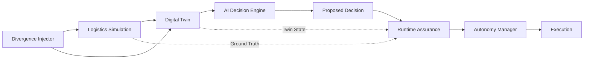
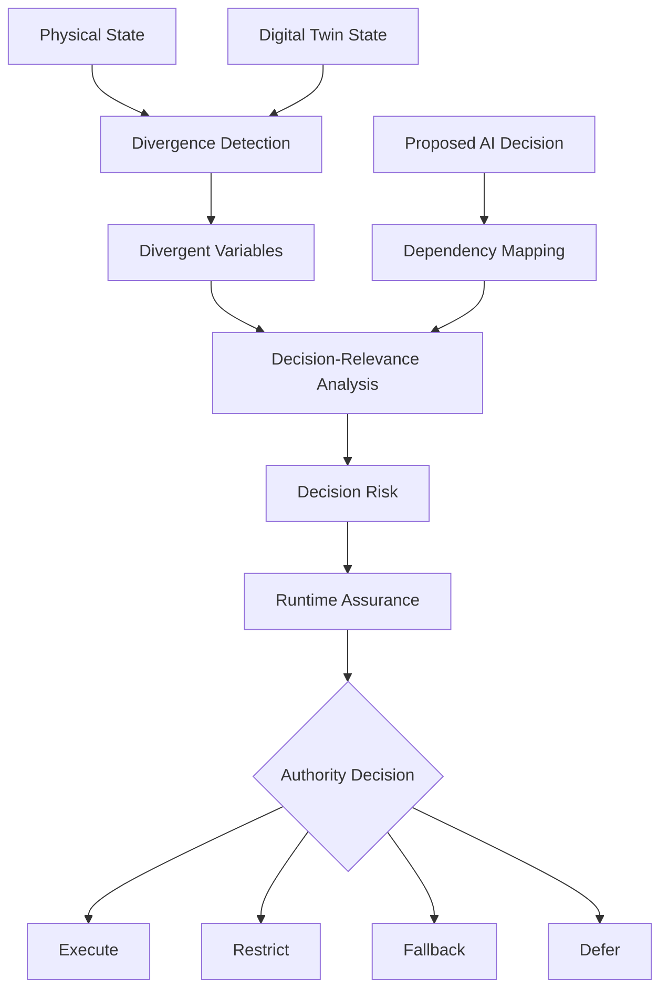
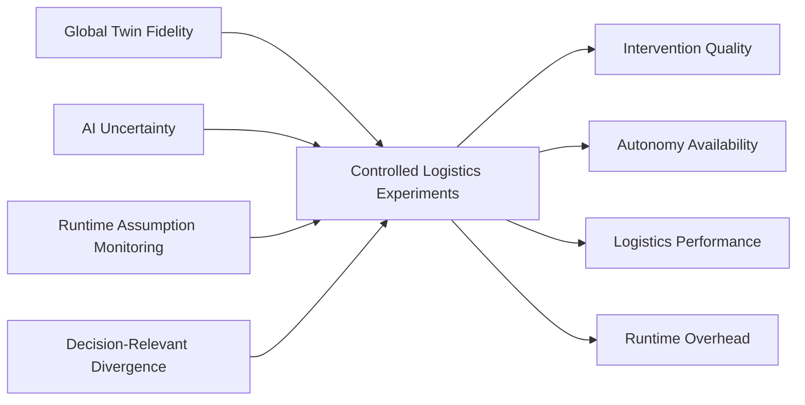
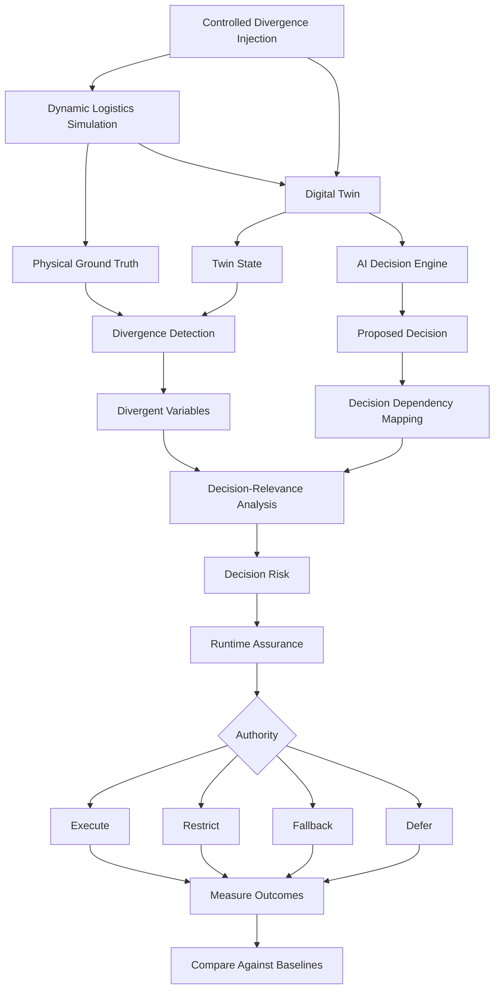

# Research Methodology

## Divergence-Aware Runtime Assurance for AI-Driven Digital Twins in Autonomous Logistics Systems

**Research stage:** Methodology Design  
**Status:** Proposed — Pre-Implementation  
**Last updated:** September 2026

---

## 1. Methodological Aim

This research investigates whether information about **decision-relevant physical–digital divergence** can improve the runtime assurance of AI-generated decisions in dynamic logistics Digital Twins.

The central experimental question is:

> **Does identifying whether physical–digital divergence affects the state variables required by a specific AI decision improve intervention quality compared with global Digital Twin fidelity and AI-uncertainty-based assurance?**

The methodology is designed to make this question experimentally testable and falsifiable.

---

## 2. Research Design

The study will use a controlled simulation-based experimental design.

The experimental environment will contain:

1. a physical logistics simulation;
2. a corresponding Digital Twin;
3. an AI decision engine;
4. controlled divergence injection;
5. divergence monitoring;
6. decision-dependency analysis;
7. runtime assurance mechanisms; and
8. an autonomy manager.



The simulator provides controlled ground truth, allowing the exact divergence and its effect on individual decisions to be measured.

---

## 3. Logistics Environment

The initial experimental domain will be **dynamic vehicle routing and dispatch**.

The environment will represent:

- vehicles;
- customer orders;
- vehicle capacities;
- vehicle availability;
- vehicle locations;
- travel times;
- delivery deadlines;
- road or network conditions;
- dynamic demand; and
- operational disruptions.

This domain provides a suitable environment because decisions depend on changing physical states and must often be made using time-sensitive information.

The research does not depend on a specific commercial logistics platform.

The objective is to create a controlled and reproducible environment in which competing assurance mechanisms can be evaluated under identical conditions.

---

## 4. Physical System Simulation

A discrete-event logistics simulator will represent the physical system.

The simulator will maintain the authoritative ground-truth state:

\[
s_t
\]

at time \(t\).

Candidate implementation technologies include:

- Python;
- SimPy;
- NumPy;
- Pandas.

The physical simulator will remain logically separate from the Digital Twin.

This separation is essential because the experiments require controlled inconsistencies between:

\[
s_t
\]

and:

\[
\hat{s}_t
\]

where \(\hat{s}_t\) represents the state maintained by the Digital Twin.

---

## 5. Digital Twin

The Digital Twin will maintain a digital representation of the logistics system.

Its state at time \(t\) is represented as:

\[
\hat{s}_t
\]

Under synchronised operation:

\[
s_t \approx \hat{s}_t
\]

During divergence:

\[
s_t \neq \hat{s}_t
\]

The Digital Twin may contain information including:

- vehicle location;
- vehicle availability;
- vehicle capacity;
- current assignments;
- order status;
- route conditions;
- estimated travel time;
- resource availability.

The Digital Twin will provide the operational state used by the decision engine.

This means that inaccurate or stale Twin information may influence AI-generated decisions.

---

## 6. AI Decision Engine

The decision engine will generate operational logistics decisions using the state exposed by the Digital Twin.

An example decision is:

> **Assign Vehicle 7 to Order 42.**

The initial experiments will prioritise interpretable decision mechanisms.

Candidate decision approaches include:

- heuristic dispatch;
- classical optimisation using OR-Tools;
- learned or AI-based policies where experimentally justified.

The methodology intentionally avoids making a highly complex AI model a prerequisite for the first experiments.

The research question concerns **runtime assurance of decisions**, rather than demonstrating that one AI algorithm outperforms another.

---

## 7. Controlled Divergence Injection

A divergence injector will deliberately create discrepancies between the physical logistics system and its Digital Twin.

This provides controlled experimental conditions.

### D0 — Synchronised Operation

The physical system and Digital Twin remain aligned.

This provides the control condition.

### D1 — Temporal Divergence

Examples include:

- delayed GPS updates;
- stale observations;
- communication latency;
- delayed warehouse updates.

### D2 — State Divergence

Examples include:

- incorrect vehicle location;
- incorrect vehicle capacity;
- incorrect availability;
- incorrect inventory;
- incorrect order status.

### D3 — Operational Divergence

Examples include:

- unreported vehicle breakdown;
- unexpected route closure;
- resource failure;
- unavailable loading infrastructure.

### D4 — Distributional Divergence

Examples include:

- demand surge;
- extreme congestion;
- unusual order patterns;
- operating conditions outside previously observed ranges.

### D5 — Compound Divergence

Multiple divergence mechanisms occur simultaneously.

For example:

```text
GPS latency
    +
Vehicle breakdown
    +
Demand surge
    +
Traffic disruption
```

Compound divergence is important because individually manageable discrepancies may interact and produce significantly different decision risks.

---

## 8. Ground-Truth Recording

Every injected divergence will be recorded.

The experiment log will capture:

- divergence start time;
- divergence duration;
- divergence category;
- affected state variable;
- affected entity;
- divergence magnitude;
- physical ground truth;
- Digital Twin value;
- decisions generated during divergence;
- decision dependencies;
- whether the divergence was decision-relevant;
- intervention performed;
- resulting operational outcome.

This allows assurance decisions to be evaluated against known experimental ground truth.

---

## 9. Decision Dependency

For each proposed decision:

\[
d_t
\]

the system will identify the subset of state information required to support that decision.

This is represented as:

\[
Dep(d_t)
\]

For example:

```text
Decision:
Assign Vehicle 7 to Order 42

Dependencies:
- Vehicle 7 availability
- Vehicle 7 location
- Vehicle 7 remaining capacity
- Order 42 deadline
- Route accessibility
- Estimated travel time
```

The initial implementation will use **explicit dependency rules**.

This provides an interpretable baseline.

More automated dependency extraction may be investigated later only if justified by the experimental results and research scope.

---

## 10. Decision-Relevant Divergence

Let:

\[
D_t
\]

represent the set of divergent state variables at time \(t\).

The basic decision-relevance relationship can then be expressed as:

\[
D_t^{rel}(d_t)
=
D_t \cap Dep(d_t)
\]

This separates two important situations.

### Decision-Irrelevant Divergence

The Digital Twin is incorrect, but the incorrect information is unrelated to the decision currently being evaluated.

### Decision-Relevant Divergence

The Digital Twin is incorrect about information required by the proposed decision.

For example:

```text
Physical system:
Vehicle 7 = BROKEN DOWN

Digital Twin:
Vehicle 7 = AVAILABLE

Proposed decision:
Assign Vehicle 7 to Order 42
```

The availability divergence is directly relevant because the decision depends on Vehicle 7 being operational.

Conversely, divergence concerning an unrelated Vehicle 3 may not justify blocking the Vehicle 7 decision.

---

## 11. DARA-DT Assurance Pipeline

The working framework is called:

> **DARA-DT — Divergence-Aware Runtime Assurance for Digital Twins**

The name is provisional and does not imply an established contribution.



The principal experimental component is the relationship:

\[
\boxed{
\text{Divergence}
+
\text{Decision Dependencies}
\rightarrow
\text{Decision-Relevant Divergence}
}
\]

The research will determine whether this information improves runtime assurance.

---

## 12. Runtime Authority

The assurance mechanism will determine what level of autonomous execution is permitted.

Candidate authority states are:

### Execute

The decision proceeds autonomously.

### Restrict

The decision may proceed under additional constraints.

### Fallback

A predefined alternative policy or safer decision mechanism is used.

### Defer

Autonomous execution is withheld pending updated information or external intervention.

The exact policy thresholds will be specified before final experiments.

---

## 13. Assurance Baselines

DARA-DT must be compared against meaningful alternatives.

| ID | Assurance Mechanism |
|---|---|
| **B0** | No runtime assurance |
| **B1** | Fixed divergence threshold |
| **B2** | Global Digital Twin fidelity |
| **B3** | AI uncertainty / confidence |
| **B4** | Operational-envelope monitoring |
| **B5** | Runtime assumption monitoring |
| **B6** | Fidelity + AI uncertainty |
| **B7** | Proposed decision-relevant divergence |

The proposed method will not be considered useful simply because it performs better than having no assurance.

It must be compared against credible competing approaches.

---

## 14. Core Experiment

The central experiment separates **global divergence magnitude** from **decision relevance**.

| Condition | Global Divergence | Decision Relevance |
|---|---:|---:|
| **A** | Low | Low |
| **B** | High | Low |
| **C** | Low | High |
| **D** | High | High |

The most important comparison is:

> **Condition B versus Condition C**

---

### Condition B — High Divergence, Low Decision Relevance

The Digital Twin may contain substantial inaccuracies.

However, those inaccuracies concern variables unrelated to the decision currently being considered.

A global-fidelity mechanism may unnecessarily intervene.

---

### Condition C — Low Divergence, High Decision Relevance

The Digital Twin may be highly accurate overall.

However, a small discrepancy affects a critical variable required by the proposed decision.

A global-fidelity mechanism may fail to intervene.

---

### Experimental Question

> **Can decision-relevance information distinguish these conditions more effectively than aggregate Digital Twin fidelity?**

This comparison is central to the proposed research.

---

## 15. Experimental Comparison

The experimental logic can be represented as:



This design tests whether decision relevance contributes information beyond established assurance signals.

---

## 16. Primary Evaluation Metrics

### 16.1 Assurance Metrics

The primary assurance metrics will include:

- inappropriate-action prevention rate;
- missed intervention rate;
- false intervention rate;
- appropriate intervention rate;
- intervention latency.

---

### 16.2 Autonomy Metrics

Autonomy will be evaluated using:

- autonomy availability;
- fallback frequency;
- restriction frequency;
- defer frequency;
- unnecessary autonomy reduction.

---

### 16.3 Logistics Metrics

Operational performance will include:

- service rate;
- delivery lateness;
- travel distance;
- logistics cost;
- vehicle utilisation;
- recovery time.

---

### 16.4 Digital Twin Metrics

Digital Twin performance may include:

- state estimation error;
- synchronisation error;
- divergence magnitude;
- divergence detection latency.

---

### 16.5 AI Metrics

Where applicable:

- decision quality;
- decision failure rate;
- predictive uncertainty;
- calibration quality.

---

### 16.6 System Metrics

Computational performance will include:

- assurance computation time;
- decision latency;
- runtime overhead;
- resource consumption where relevant.

---

## 17. Critical Trade-Off

A runtime-assurance system could trivially prevent inappropriate autonomous actions by refusing most autonomous decisions.

Such a system would provide little operational value.

The evaluation must therefore consider the trade-off:

\[
\boxed{
\text{Assurance Effectiveness}
\leftrightarrow
\text{Autonomy Availability}
\leftrightarrow
\text{Logistics Performance}
}
\]

A useful assurance mechanism should reduce inappropriate autonomous actions without producing unacceptable degradation in autonomy or logistics performance.

---

## 18. Experimental Repetition

Experiments will be repeated using multiple random seeds.

Each assurance strategy will be evaluated under equivalent:

- logistics scenarios;
- demand patterns;
- divergence events;
- disruption conditions;
- random seeds where appropriate.

This enables paired comparison between assurance strategies.

The final number of experimental repetitions will be selected using appropriate statistical or power-analysis reasoning rather than chosen to produce a desired result.

---

## 19. Statistical Analysis

Statistical analysis will depend on the final metric distributions and experimental design.

Candidate techniques include:

- confidence intervals;
- effect sizes;
- paired comparisons;
- non-parametric alternatives where assumptions are violated;
- multiple-comparison correction where required.

Statistical significance alone will not be treated as sufficient evidence.

Results will also be interpreted according to:

- effect magnitude;
- operational importance;
- autonomy impact;
- logistics consequences.

---

## 20. Ablation Studies

The proposed approach will be decomposed experimentally to determine which components contribute useful information.

Candidate ablations include:

- without decision dependencies;
- without AI uncertainty;
- without operational consequence;
- without temporal divergence;
- without state divergence;
- without distribution-shift evidence;
- without compound-divergence handling.

For example:

```text
Full DARA-DT
        versus
DARA-DT without Decision Relevance
```

is particularly important.

If removing decision relevance produces no meaningful reduction in performance, the central hypothesis would be weakened.

---

## 21. Reproducibility

Experiments will record:

- experiment identifier;
- random seed;
- scenario configuration;
- divergence configuration;
- model version;
- assurance strategy;
- dependency configuration;
- software version;
- resulting metrics.

Planned tooling includes:

- **uv** for Python dependency and environment management;
- configuration management such as Hydra where justified;
- MLflow or equivalent for experiment tracking;
- pytest for automated testing;
- GitHub Actions for continuous integration;
- Docker for reproducible execution where appropriate.

The repository will contain the configuration and code required to reproduce reported experiments.

---

## 22. Research Validity

### Internal Validity

Competing assurance strategies will be evaluated using equivalent scenarios and controlled divergence conditions.

This reduces the likelihood that differences result from inconsistent experimental conditions.

---

### Construct Validity

Key concepts will receive explicit operational definitions before final experimentation, including:

- divergence;
- decision relevance;
- intervention;
- decision failure;
- autonomy availability;
- operational consequence.

---

### External Validity

Simulation results cannot establish universal effectiveness in real-world logistics operations.

Conclusions will therefore be limited to the evaluated conditions.

Claims of real-world deployment effectiveness will not be made without corresponding evidence.

---

### Conclusion Validity

Multiple experimental runs, uncertainty reporting, effect sizes, and appropriate statistical comparisons will be used to reduce unsupported conclusions.

Negative and null results will be retained.

---

## 23. Falsification Criteria

The proposed research hypothesis will be weakened or rejected if decision-relevant divergence:

- does not improve inappropriate-action detection;
- provides no meaningful improvement over global fidelity;
- provides no meaningful improvement over AI uncertainty;
- provides no meaningful improvement over runtime assumption monitoring;
- produces excessive false interventions;
- substantially reduces autonomy availability;
- substantially damages logistics performance; or
- introduces unacceptable runtime overhead.

The experimental methodology therefore allows the proposed contribution to fail.

---

## 24. Experimental Integrity

The following principles will be followed:

1. baseline definitions will be established before final comparison;
2. experimental configurations will be version controlled;
3. negative results will not be removed;
4. metrics will not be selectively reported;
5. divergence scenarios will be documented;
6. experimental seeds will be recorded;
7. claims will be limited to available evidence;
8. proposed mechanisms will not be described as validated before evaluation.

---

## 25. Scope Boundaries

The initial research will focus on:

> **Dynamic logistics decision-making under physical–digital divergence.**

The project will not initially attempt to solve:

- general-purpose autonomous-agent safety;
- complete cybersecurity of Digital Twins;
- blockchain-based logistics;
- large-scale multi-agent coordination;
- general-purpose LLM autonomy;
- all forms of supply-chain optimisation.

These areas may be relevant to future work but are outside the core experimental question.

This scope control is intended to keep the research experimentally defensible and achievable.

---

## 26. Methodology Summary

The complete methodology is:



The central scientific comparison is:

\[
\boxed{
\text{Global Fidelity}
\quad vs \quad
\text{AI Uncertainty}
\quad vs \quad
\text{Assumption Monitoring}
\quad vs \quad
\text{Decision-Relevant Divergence}
}
\]

---

## 27. Methodology Status

| Component | Status |
|---|---|
| Research design | Defined |
| Experimental domain | Defined |
| Physical simulation | Planned |
| Digital Twin | Planned |
| AI decision engine | Planned |
| Divergence taxonomy | Defined conceptually |
| Ground-truth strategy | Defined |
| Decision dependency mechanism | Proposed |
| DARA-DT framework | Proposed |
| Assurance baselines | Defined conceptually |
| Core experiment | Defined |
| Evaluation metrics | Defined |
| Statistical analysis | Planned |
| Ablation strategy | Defined conceptually |
| Implementation | Not started |
| Experimental results | None claimed |

---

## 28. Next Research Artifact

The next document will be:

```text
docs/system_architecture.md
```

It will translate this methodology into an implementable software architecture, including:

- simulator;
- Digital Twin state store;
- decision engine;
- divergence injector;
- divergence monitor;
- dependency mapper;
- assurance engine;
- autonomy manager;
- experiment logger;
- evaluation pipeline.

Implementation should begin only after the architecture and experimental protocol are sufficiently specified.

---

## Research Integrity Note

This methodology describes the **planned research design**.

It does not claim that DARA-DT improves safety, reliability, logistics performance, or autonomous decision quality.

Those claims can only be evaluated after controlled experiments have been implemented, executed, analysed, and compared against the defined baselines.
