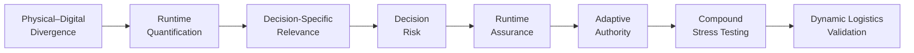
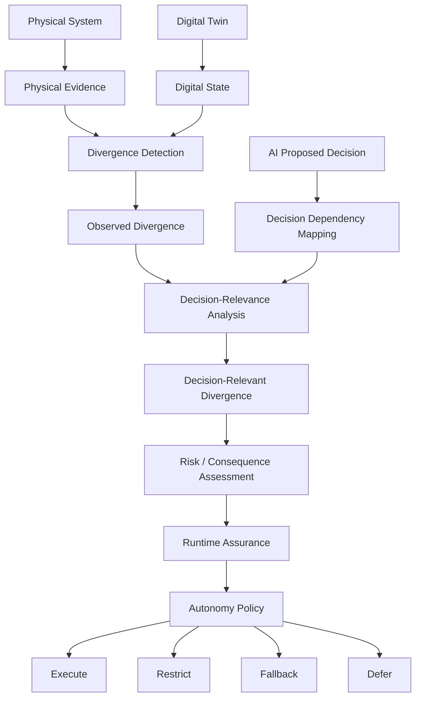
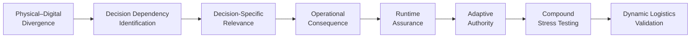

# Novelty Evidence Matrix

## Decision-Relevant Divergence Assurance for AI-Driven Logistics Digital Twins

**Parent research project:** Divergence-Aware Runtime Assurance for AI-Driven Digital Twins in Autonomous Logistics Systems
**Document type:** Novelty Challenge and Evidence Matrix
**Research stage:** Pre-implementation novelty validation
**Status:** Living research document
**Last updated:** September 2026

---

# 1. Purpose

This document evaluates whether the proposed research contribution survives comparison with the closest existing research.

It serves as a formal:

> **GO → REFINE → STOP**

gate before substantial implementation begins.

The objective is not to demonstrate that the proposed research is novel.

The objective is to determine whether sufficient evidence exists to justify investigating the proposed research question.

The review therefore deliberately prioritises literature capable of **challenging the proposed contribution**.

---

# 2. Candidate Contribution Under Test

The current candidate contribution is:

> **A decision-relevant divergence assurance approach that determines whether physical–digital divergence affects the information required by a specific AI-generated logistics decision and uses that evidence, together with uncertainty and operational consequence, to regulate autonomous execution at runtime.**

This statement contains several individual capabilities that already exist within the wider literature.

The potential contribution therefore depends on the **relationship between those capabilities**, rather than the novelty of any individual component.

---

# 3. Research Capability Chain

The candidate contribution can be decomposed into the following chain:



A credible existing study demonstrating the complete chain would substantially weaken the proposed novelty.

---

# 4. Capability Definitions

To avoid manipulating the literature comparison after reviewing results, each capability is defined before final evidence coding.

## C1 — Physical–Digital Divergence

The study explicitly considers disagreement, mismatch, desynchronisation, drift, or fidelity degradation between a physical system and its Digital Twin.

---

## C2 — Runtime Quantification

The divergence is detected or quantified during system operation rather than only through offline post-analysis.

---

## C3 — Decision-Specific Relevance

The system evaluates whether the identified divergence affects the **state information, assumptions, constraints, or dependencies required for a particular proposed decision**.

This is more specific than detecting global Digital Twin degradation.

---

## C4 — Decision Risk

The system relates the detected condition to the potential likelihood and/or consequence of an inappropriate operational decision.

---

## C5 — Runtime Assurance

Evidence is evaluated during operation to determine whether system behaviour remains within acceptable conditions.

---

## C6 — Adaptive Authority

Runtime evidence can modify decision authority through mechanisms such as:

* execute;
* restrict;
* modify;
* escalate;
* fallback;
* defer;
* reject.

---

## C7 — Compound Stress Testing

The method is evaluated under multiple simultaneous sources of degradation, disruption, uncertainty, or divergence.

---

## C8 — Dynamic Logistics Validation

The complete or relevant part of the method is evaluated in transportation, supply chain, warehousing, fleet management, routing, dispatch, or another dynamic logistics environment.

---

# 5. Coding Scheme

Each study will be coded using the following scheme.

| Symbol | Meaning                                                   |
| ------ | --------------------------------------------------------- |
| **✓**  | Explicitly demonstrated                                   |
| **△**  | Partially addressed                                       |
| **○**  | Conceptually proposed but not experimentally demonstrated |
| **—**  | Not demonstrated in reviewed evidence                     |
| **?**  | Requires further full-text verification                   |

A blank cell must not be interpreted as evidence of absence.

---

# 6. Evidence Quality

Capability coverage alone is insufficient.

Each study will also receive an evidence-maturity classification.

| Level  | Evidence Maturity                                        |
| ------ | -------------------------------------------------------- |
| **E0** | Conceptual argument only                                 |
| **E1** | Architecture / framework proposed                        |
| **E2** | Simulation or constructed experimental validation        |
| **E3** | Laboratory / prototype validation                        |
| **E4** | Real-world or operational case validation                |
| **E5** | Sustained operational deployment / longitudinal evidence |

This prevents a conceptual framework and an operationally validated system from being treated as equivalent evidence.

---

# 7. Core Novelty Evidence Matrix

| ID   | Study / Initiative                                   | C1 Divergence | C2 Runtime Quant. | C3 Decision Relevance | C4 Decision Risk | C5 Runtime Assurance | C6 Adaptive Authority | C7 Compound Stress | C8 Logistics | Evidence |
| ---- | ---------------------------------------------------- | ------------: | ----------------: | --------------------: | ---------------: | -------------------: | --------------------: | -----------------: | -----------: | -------: |
| ST01 | UK Digital Twin Definition                           |             ✓ |                 △ |                     △ |                △ |                    △ |                     — |                  — |            — |       E1 |
| ST02 | DARTER                                               |             ✓ |                 ✓ |                     △ |                △ |                    ✓ |                     △ |                  △ |            △ |   E1–E2* |
| SR01 | Tolia & Ponis (2026)                                 |             △ |                 △ |                     △ |                △ |                    △ |                     △ |                  △ |            ✓ |   Review |
| SR02 | Autonomous & Agentic AI + DT Logistics Review (2026) |             ✓ |                 ✓ |                     △ |                ✓ |                    ✓ |                     ✓ |                  △ |            ✓ |   Review |
| PS01 | Edge–Cloud DT for Sustainable Logistics (2026)       |             △ |                 ✓ |                     △ |                △ |                    △ |                     ✓ |                  ✓ |            ✓ |       E4 |
| CF01 | Trustworthy Agentic Supply Chains (2026)             |             △ |                 △ |                     △ |                ✓ |                    ✓ |                     ✓ |                  ✓ |            ✓ |       E1 |
| PS02 | Adaptive DT Synchronisation                          |             ✓ |                 ✓ |                     — |                — |                    △ |                     △ |                  △ |            ? |      E2* |
| PS03 | Near-Real-Time DT Fidelity Measurement               |             ✓ |                 ✓ |                     — |                — |                    △ |                     — |                  — |            △ |   E2–E3* |
| PS04 | Autonomous Logistics DT                              |             △ |                 ✓ |                     △ |                △ |                    △ |                     ✓ |                  △ |            ✓ |   E2–E4* |
| PS05 | Adaptive Logistics Control                           |             △ |                 ✓ |                     △ |                △ |                    △ |                     ✓ |                  △ |            ✓ |   E2–E4* |

`*` Evidence maturity remains provisional until the full study and validation design have been checked.

---

# 8. Most Important Challenge: Autonomous Logistics Assurance Review

A 2026 systematic review of autonomous and agentic AI in transportation and smart logistics is particularly important to the proposed research.

The review characterises autonomous decision systems across multiple dimensions including:

* agency;
* decision topology;
* reasoning mechanism;
* Digital Twin relationship;
* human involvement;
* trustworthiness;
* operational objective;
* validation maturity.

The review also distinguishes Digital Twins that merely monitor systems from twins that evaluate decisions or participate adaptively in operational decision loops.

Most importantly for this research, its proposed assurance architecture considers evidence such as:

* operational risk;
* calibrated confidence;
* constraint margin;
* distributional validity;
* Digital Twin divergence;
* safety constraints;
* fallback mechanisms.

This substantially overlaps with several elements of the proposed DARA-DT concept.

---

# 9. Consequence of SR02 for the Proposed Novelty

The following concepts can therefore **not** safely be presented as the central novelty:

```text
AI uncertainty
        +
Digital Twin divergence
        +
Operational risk
        +
Runtime gating
        +
Fallback
```

That conceptual combination is already emerging in the literature.

Similarly:

> **Using assurance evidence to decide whether an autonomous system should execute, escalate, or fail safely**

is not sufficiently distinctive by itself.

The candidate contribution must therefore be narrower.

---

# 10. Second Major Challenge: Dynamic Decision Authority

Recent logistics Digital Twin research also demonstrates dynamic allocation of decision authority.

For example, Edge–Cloud Digital Twin architectures can respond to:

* latency;
* communication uncertainty;
* traffic variability;
* network disruption;
* computational availability.

Decision authority can then shift between local and central computational layers.

Therefore:

> **Dynamic decision authority in logistics cannot itself be claimed as novel.**

The important question becomes **what evidence causes authority to change and whether that evidence is explicitly related to the information dependencies of the proposed decision**.

---

# 11. Refined Candidate Differentiator

Following the novelty challenge, the proposed contribution is narrowed to:

> **Decision-specific physical–digital dependency analysis.**

The key question becomes:

> **Is the Digital Twin wrong about something that the proposed AI decision actually depends upon?**

This differs conceptually from:

### Global Fidelity

> How different is the Digital Twin from reality overall?

### AI Confidence

> How confident is the AI in its proposed decision?

### Distributional Validity

> Does the current operating condition resemble the system's validated domain?

### Constraint Checking

> Does the proposed action violate a known operational constraint?

### Proposed Decision-Relevance Analysis

> **Which physical or digital state variables does this particular decision depend upon, and have any of those dependencies become unreliable?**

---

# 12. Decision Dependency Model

Let an AI-generated decision at time \(t\) be:

$$
d_t
$$

Let the Digital Twin contain state:

$$
\hat{s}_t =
\{
\hat{s}_1,
\hat{s}_2,
...,
\hat{s}_n
\}
$$

A decision does not necessarily depend equally on every state variable.

Define a provisional dependency relation:

$$
Dep(d_t)
\subseteq
\hat{s}_t
$$

For example:

```text
Decision:
Assign Vehicle 7 to Order 42
```

may depend upon:

```text
Vehicle 7 availability
Vehicle 7 location
Vehicle 7 remaining capacity
Order deadline
Road accessibility
Travel-time estimate
```

but may not depend upon:

```text
Vehicle 3 fuel level
Warehouse C inventory
Weather in an unrelated region
```

This distinction creates the basis for decision-relevant divergence.

---

# 13. Example

Assume:

### Physical State

```text
Vehicle 7

Location = Zone B
Status = BROKEN DOWN
Load = 42%
```

### Digital Twin

```text
Vehicle 7

Location = Zone B
Status = AVAILABLE
Load = 40%
```

The system contains at least two divergences.

### Divergence A

```text
Availability:
Physical = BROKEN DOWN
Twin = AVAILABLE
```

### Divergence B

```text
Load:
Physical = 42%
Twin = 40%
```

For the decision:

```text
Assign Vehicle 7 to Order 42
```

availability is a critical dependency.

Therefore:

$$
Rel(D_A,d_t)
\gg
Rel(D_B,d_t)
$$

The proposed research investigates whether explicitly modelling this relationship improves assurance decisions.

---

# 14. Updated Research Logic



The key candidate differentiator is the relationship:

$$
\boxed{
\text{Observed Divergence}
+
\text{Decision Dependencies}
\rightarrow
\text{Decision-Relevant Divergence}
}
$$

Everything downstream must be evaluated against existing assurance methods.

---

# 15. Three-Way Scientific Comparison

The proposed experimental programme should eventually compare at least three assurance strategies.

## Strategy A — Global Fidelity Assurance

```text
Physical state
      ↓
Twin state
      ↓
Global divergence
      ↓
Threshold
      ↓
Intervene / Continue
```

Research question:

> Does overall Twin fidelity provide sufficient evidence for intervention?

---

## Strategy B — AI Uncertainty Assurance

```text
AI decision
      ↓
Uncertainty
      ↓
Threshold
      ↓
Intervene / Continue
```

Research question:

> Does AI uncertainty reliably identify decisions made unsafe or inappropriate by Twin divergence?

---

## Strategy C — Decision-Relevant Divergence Assurance

```text
Divergence
      +
Decision Dependencies
      ↓
Decision-Relevant Divergence
      +
Operational Consequence
      ↓
Runtime Assurance
```

Research question:

> Does explicitly modelling the relationship between divergence and decision dependencies improve intervention quality?

---

# 16. Why This Comparison Matters

Consider a Digital Twin containing 100 state variables.

Suppose 20 variables currently diverge from reality.

A global fidelity mechanism may determine:

> Twin reliability = degraded.

However, a proposed routing decision might depend on only six state variables.

If all six remain valid, intervention may be unnecessary.

Conversely, only **one** of 100 variables might diverge.

Global fidelity could remain extremely high.

But if that single variable is:

```text
Vehicle availability
```

for the vehicle currently being dispatched, the decision may be invalid.

Therefore:

$$
\text{Global Twin Accuracy}
\not\Rightarrow
\text{Decision Validity}
$$

This relationship is a central hypothesis of the proposed research.

---

# 17. Proposed Hypotheses

The following hypotheses remain provisional until the literature review is complete.

### H1

Global Digital Twin fidelity alone will not consistently predict the validity of individual AI-generated logistics decisions.

### H2

Divergence affecting decision-dependent state variables will have a stronger relationship with decision failure than divergence affecting unrelated state variables.

### H3

Decision-relevant divergence assurance will reduce inappropriate autonomous actions compared with global-fidelity and AI-uncertainty assurance baselines.

### H4

Decision-relevant assurance can reduce inappropriate actions without causing unacceptable reductions in autonomy availability or logistics performance.

### H5

Compound divergence affecting multiple decision dependencies will produce different assurance requirements from isolated divergence of equivalent aggregate magnitude.

These hypotheses are falsifiable and may be rejected by experimental evidence.

---

# 18. Novelty Kill Test

The candidate contribution should be reconsidered if credible existing research demonstrates the following complete mechanism:



The strongest novelty threat would therefore be a study that:

1. identifies physical–digital divergence;
2. identifies the state dependencies of a proposed AI decision;
3. determines whether divergence affects those dependencies;
4. evaluates the operational consequence;
5. performs runtime assurance;
6. modifies autonomous execution;
7. evaluates compound divergence; and
8. validates the approach in dynamic logistics.

---

# 19. Novelty Threat Classification

Candidate competing studies will be classified as follows.

| Threat                   | Interpretation                                                                          |
| ------------------------ | --------------------------------------------------------------------------------------- |
| **T0 — None**            | Little conceptual overlap                                                               |
| **T1 — Low**             | Shares one or two supporting capabilities                                               |
| **T2 — Moderate**        | Shares several capabilities but not decision-relevance mechanism                        |
| **T3 — High**            | Includes decision-aware assurance but lacks important elements or logistics validation  |
| **T4 — Critical**        | Implements most of the proposed mechanism in a comparable logistics setting             |
| **T5 — Novelty Failure** | Demonstrates substantially the same contribution with comparable or stronger validation |

This classification is intended to support transparent research decisions rather than protect the proposed idea.

---

# 20. Current Threat Assessment

Based on the evidence examined so far:

### Runtime Assurance

**Threat: HIGH**

Runtime assurance is already an active Digital Twin and autonomous-system research area.

### Digital Twin Divergence Detection

**Threat: HIGH**

Physical–digital divergence and fidelity monitoring are established concerns.

### AI Uncertainty

**Threat: HIGH**

Uncertainty-aware AI is extensively established.

### Adaptive Authority

**Threat: HIGH**

Dynamic and bounded decision authority already appears in autonomous-system and logistics research.

### Logistics Digital Twins

**Threat: HIGH**

AI-enabled and decision-active logistics Digital Twins already exist.

### Compound Stress Testing

**Threat: MODERATE**

Stress testing exists, but the precise combination of decision dependencies and compound physical–digital divergence requires deeper investigation.

### Decision-Relevant Divergence

**Threat: UNKNOWN / MODERATE**

This is currently the most important unresolved area.

Further full-text searching is required before this can be treated as a defensible research gap.

---

# 21. Evidence Gaps

The literature review must now answer five specific questions.

### Gap Test 1

Has previous research explicitly represented the **state-variable dependencies of individual AI-generated Digital Twin decisions**?

### Gap Test 2

Has physical–digital divergence been evaluated according to those decision dependencies?

### Gap Test 3

Has decision-relevant divergence been compared experimentally against global Twin fidelity?

### Gap Test 4

Has it been compared against AI uncertainty-based assurance?

### Gap Test 5

Has the complete mechanism been evaluated under controlled and compound logistics disruptions?

The proposed research should not proceed as currently formulated if strong evidence answers all five questions positively.

---

# 22. Evidence Maturity Problem

The literature must also be evaluated according to validation maturity.

A conceptual architecture demonstrating:

```text
Sense → Analyse → Decide → Act
```

is not equivalent to an experimentally validated system.

Similarly:

```text
Simulation
```

is not equivalent to:

```text
Operational deployment.
```

The novelty assessment must therefore consider both:

$$
\text{Capability Coverage}
$$

and:

$$
\text{Evidence Maturity}
$$

A contribution may potentially exist in rigorous experimental validation even when a similar conceptual framework has previously been proposed.

---

# 23. Candidate Experimental Contribution

Even if parts of the methodological concept already exist, a second contribution may remain in systematic evaluation.

The proposed benchmark would compare:

```text
Synchronised operation
        ↓
Single divergence
        ↓
Decision-irrelevant divergence
        ↓
Decision-relevant divergence
        ↓
Multiple divergence
        ↓
Compound divergence
        ↓
Distribution shift
```

Because divergence is injected deliberately, the benchmark can preserve ground truth concerning:

* divergence onset;
* affected state variables;
* decision dependencies;
* operational consequence;
* required intervention;
* actual decision outcome.

This could enable controlled comparison of assurance mechanisms.

---

# 24. Candidate Benchmark Comparison

| System                                 | Twin Fidelity | AI Uncertainty | Decision Relevance | Runtime Assurance | Adaptive Authority |
| -------------------------------------- | ------------: | -------------: | -----------------: | ----------------: | -----------------: |
| B0 — No Assurance                      |             — |              — |                  — |                 — |                  — |
| B1 — Global Fidelity                   |             ✓ |              — |                  — |                 ✓ |                  △ |
| B2 — AI Uncertainty                    |             — |              ✓ |                  — |                 ✓ |                  △ |
| B3 — Fidelity + Uncertainty            |             ✓ |              ✓ |                  — |                 ✓ |                  ✓ |
| Proposed — Decision-Relevant Assurance |             ✓ |              ✓ |                  ✓ |                 ✓ |                  ✓ |

This table represents the intended experimental comparison, not established superiority.

---

# 25. Candidate Evaluation Metrics

## Divergence Detection

* detection precision;
* detection recall;
* detection latency;
* divergence estimation error.

## Decision Assurance

* inappropriate-action prevention rate;
* missed intervention rate;
* false intervention rate;
* appropriate intervention rate.

## Autonomy

* autonomy availability;
* fallback frequency;
* restriction frequency;
* unnecessary autonomy reduction.

## Logistics

* service rate;
* travel cost;
* lateness;
* resource utilisation;
* recovery time.

## Computational Performance

* decision latency;
* assurance overhead;
* computational cost.

---

# 26. Critical Trade-Off

A runtime-assurance mechanism can trivially reduce unsafe or inappropriate autonomous actions by refusing to allow autonomous actions.

Such a system would have little operational value.

Therefore the project must examine:

$$
\boxed{
\text{Assurance Effectiveness}
\leftrightarrow
\text{Autonomy Availability}
\leftrightarrow
\text{Operational Performance}
}
$$

The proposed approach should be evaluated on this trade-off rather than on failure prevention alone.

---

# 27. Current Novelty Position

The literature reviewed so far provides **insufficient evidence to claim confirmed novelty**.

However, it also does not yet demonstrate that the complete proposed decision-dependency mechanism has already been established and validated in dynamic logistics.

The current position is therefore:

> **REFINE AND CONTINUE NOVELTY VALIDATION**

rather than:

> **NOVELTY CONFIRMED**

or:

> **RESEARCH GAP REJECTED**

---

# 28. Provisional Research Gap

Subject to further evidence, the current candidate gap is:

> **A lack of sufficiently validated methods for determining whether physical–digital divergence affects the state dependencies of a specific AI-generated logistics decision and using that decision-level evidence to regulate autonomous execution under dynamic and compound disruptions.**

The phrase **“sufficiently validated”** is important.

A conceptual proposal alone does not establish an experimentally validated solution.

---

# 29. Research Integrity Rule

The project will follow the principle:

> **The strongest competing evidence determines the research boundary.**

No publication will be excluded because it threatens the proposed contribution.

If a study substantially implements the proposed mechanism, it will be classified accordingly and the research question will be revised.

---

# 30. GO / REFINE / STOP Criteria

## GO

Proceed with the proposed research if the evidence indicates that decision-relevant physical–digital divergence has not been sufficiently investigated or experimentally validated for autonomous logistics.

## REFINE

Narrow the research if similar decision-aware assurance mechanisms exist but important methodological or validation gaps remain.

## STOP

Reject the proposed contribution if high-quality existing work already demonstrates the complete mechanism with comparable or stronger validation.

---

# 31. Current Decision

## **REFINE / CONTINUE**

The project should continue through literature validation.

Implementation of the proposed novel mechanism should **not yet begin**.

The next research task is to expand this matrix with the closest peer-reviewed studies and conduct full-text capability coding.

---

# 32. Next Research Artifact

Following completion of the evidence search, the next document should be:

```text
docs/research_questions.md
```

However, the research questions should only be frozen after the novelty matrix has been sufficiently populated.

The immediate literature task is therefore:

> **Identify and analyse the strongest 15–25 competing studies against C1–C8.**

---

# References

The Alan Turing Institute. (2026). *DARTER: Digital Twin Assurance via Runtime Trust and Evidence Reporting*.

Nozari, H., & Yordanova, Z. (2026). Multi-Objective Edge–Cloud Digital Twin Architecture for Sustainable Logistics. *Expert Systems with Applications, 327*, 132899.

Tolia, A., & Ponis, S. T. (2026). Digital Twins for Real-Time Decision-Making in Supply Chain Management and Logistics: A Systematic Review. *Information, 17*(8), 732.

*Autonomous and Agentic AI with Digital Twins for Resilient Transportation and Smart Logistics: A Systematic Review, Multi-Axis Taxonomy, and Evidence-Informed Human-in-the-Loop Reference Architecture.* (2026). *Systems, 14*(9), 1174.

Chinnaraju, A., & Loganathan, K. A. (2026). Trustworthy Agentic Supply Chains: A Governance Framework for Digital Twin Orchestrated AI Decisioning Under Compliance, Auditability, and Data Sovereignty Constraints. *International Journal of Latest Technology in Engineering, Management & Applied Science, 15*(1), 245–318.

**Reference policy:** Additional references will be added only after their bibliographic information and research claims have been verified.
