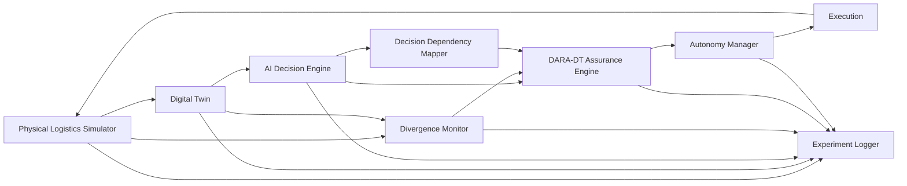
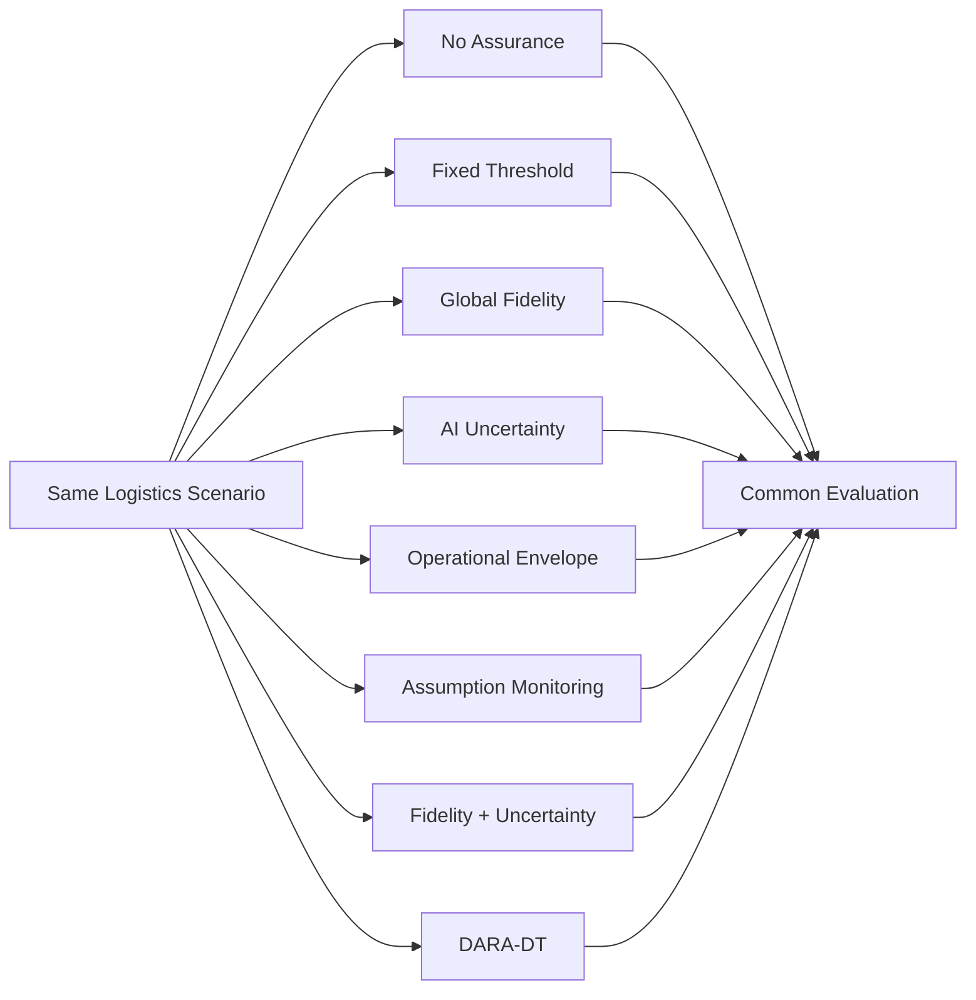

# System Architecture

## Divergence-Aware Runtime Assurance for AI-Driven Digital Twins in Autonomous Logistics Systems

**Framework:** DARA-DT  
**Research stage:** Architecture Design  
**Status:** Proposed — Pre-Implementation  
**Last updated:** September 2026

---

## 1. Architecture Purpose

This document translates the research methodology into an implementable software architecture.

The system is designed to investigate:

> **Whether decision-relevant physical–digital divergence can improve runtime assurance of AI-generated decisions in dynamic logistics Digital Twins.**

The architecture deliberately separates:

- physical simulation;
- Digital Twin representation;
- decision generation;
- divergence injection;
- divergence detection;
- decision-dependency mapping;
- runtime assurance;
- autonomy management; and
- experimental evaluation.

This separation allows individual research components to be independently tested, replaced, and compared.

---

## 2. System Overview

The proposed architecture contains nine principal components:

1. Logistics Simulator
2. Digital Twin
3. Divergence Injector
4. AI Decision Engine
5. Divergence Monitor
6. Decision Dependency Mapper
7. DARA-DT Assurance Engine
8. Autonomy Manager
9. Experiment and Evaluation Pipeline



---

# 3. Architectural Principle

The most important architectural rule is:

> **The physical simulator and Digital Twin must maintain separate states.**

Let:

\[
s_t
\]

represent the authoritative physical state.

Let:

\[
\hat{s}_t
\]

represent the Digital Twin state.

Under normal conditions:

\[
s_t \approx \hat{s}_t
\]

Under experimental divergence:

\[
s_t \neq \hat{s}_t
\]

The AI decision engine primarily observes:

\[
\hat{s}_t
\]

rather than the hidden physical ground truth.

This prevents the AI controller from bypassing the Digital Twin and ensures that divergence can genuinely influence decisions.

---

# 4. Component 1 — Physical Logistics Simulator

## Purpose

The Logistics Simulator represents the physical logistics environment and provides experimental ground truth.

Candidate implementation:

**SimPy + Python**

The simulator will initially model dynamic vehicle routing and dispatch.

---

## Responsibilities

The simulator maintains:

- vehicles;
- vehicle locations;
- vehicle capacities;
- vehicle availability;
- customer orders;
- order deadlines;
- road/network conditions;
- travel times;
- active assignments;
- completed deliveries;
- operational disruptions.

---

## Example Physical State

```python
physical_state = {
    "time": 125,
    "vehicles": {
        "vehicle_07": {
            "location": "node_14",
            "capacity_remaining": 40,
            "available": False,
            "status": "broken_down"
        }
    },
    "orders": {
        "order_42": {
            "location": "node_21",
            "demand": 20,
            "deadline": 180,
            "status": "waiting"
        }
    }
}
```

This state represents experimental ground truth.

It must not automatically become visible to the AI decision engine.

---

# 5. Component 2 — Digital Twin

## Purpose

The Digital Twin maintains the digital representation used for operational decision-making.

Its state is:

\[
\hat{s}_t
\]

The Digital Twin receives updates from the simulated physical environment.

---

## Responsibilities

The Digital Twin will:

- maintain current digital state;
- receive physical-state updates;
- timestamp observations;
- expose state to the decision engine;
- retain update metadata;
- support delayed or missing updates;
- provide information required for divergence measurement.

---

## Example Twin State

```python
twin_state = {
    "time": 125,
    "vehicles": {
        "vehicle_07": {
            "location": "node_14",
            "capacity_remaining": 40,
            "available": True,
            "status": "operational",
            "last_update": 115
        }
    }
}
```

The physical system may know that Vehicle 7 has failed while the Digital Twin still reports it as operational.

This produces controlled physical–digital divergence.

---

# 6. Component 3 — Divergence Injector

## Purpose

The Divergence Injector creates controlled experimental discrepancies between physical and digital states.

It is a research instrument rather than part of the normal operational Digital Twin.

---

## Divergence Types

The injector will support:

```text
D0  Synchronised
D1  Temporal
D2  State
D3  Operational
D4  Distributional
D5  Compound
```

---

## Example Configuration

```yaml
divergence:
  type: operational
  target: vehicle_07.status
  start_time: 120
  duration: 30

  physical_value: broken_down
  twin_value: operational
```

Configurations should be stored rather than hard-coded into experiments.

This enables reproducibility.

---

# 7. Component 4 — AI Decision Engine

## Purpose

The Decision Engine proposes logistics actions based primarily on the Digital Twin state.

Conceptually:

\[
d_t = \pi(\hat{s}_t)
\]

where:

- \(\pi\) = decision policy;
- \(\hat{s}_t\) = Digital Twin state;
- \(d_t\) = proposed decision.

---

## Initial Decision Types

The first implementation will focus on decisions such as:

```text
ASSIGN vehicle TO order
```

Example:

```python
decision = {
    "decision_id": "decision_105",
    "action": "assign_vehicle",
    "vehicle_id": "vehicle_07",
    "order_id": "order_42",
    "timestamp": 125
}
```

---

## Decision Strategies

The architecture will allow interchangeable controllers.

Candidate controllers:

```text
Heuristic Controller
        ↓
OR-Tools Optimisation
        ↓
AI / Learned Controller
```

The assurance framework should not depend on one specific controller.

---

# 8. Component 5 — Divergence Monitor

## Purpose

The Divergence Monitor identifies discrepancies between physical and Digital Twin states.

Conceptually:

\[
D_t = \Delta(s_t,\hat{s}_t)
\]

where:

\[
D_t
\]

is the set of detected divergences.

---

## Example Output

```python
divergence = {
    "variable": "vehicle_07.status",
    "physical_value": "broken_down",
    "twin_value": "operational",
    "category": "operational",
    "magnitude": 1.0,
    "detected_at": 125
}
```

Multiple divergences may exist simultaneously.

---

# 9. Component 6 — Decision Dependency Mapper

## Purpose

The Dependency Mapper identifies which state variables a proposed decision depends upon.

For decision:

\[
d_t
\]

the dependency set is:

\[
Dep(d_t)
\]

---

## Example

For:

```text
Assign Vehicle 7 to Order 42
```

the dependency set may contain:

```text
vehicle_07.available
vehicle_07.status
vehicle_07.location
vehicle_07.capacity_remaining
order_42.location
order_42.demand
order_42.deadline
route_07_42.accessibility
route_07_42.travel_time
```

---

## Initial Implementation

The first version will use explicit rules.

Example:

```python
dependencies = {
    "assign_vehicle": [
        "vehicle.available",
        "vehicle.status",
        "vehicle.location",
        "vehicle.capacity_remaining",
        "order.location",
        "order.demand",
        "order.deadline",
        "route.accessibility",
        "route.travel_time"
    ]
}
```

Explicit rules make the initial experiments:

- interpretable;
- auditable;
- reproducible;
- easier to validate.

Automated dependency learning may be investigated later if required.

---

# 10. Decision-Relevance Engine

The architecture combines divergence information with decision dependencies.

Given:

\[
D_t
\]

and:

\[
Dep(d_t)
\]

decision-relevant divergence is:

\[
D_t^{rel}(d_t)
=
D_t \cap Dep(d_t)
\]

---

## Example 1 — Relevant Divergence

```text
Divergence:
vehicle_07.status

Decision:
Assign vehicle_07 to order_42

Dependency:
vehicle_07.status

Result:
DECISION-RELEVANT
```

---

## Example 2 — Irrelevant Divergence

```text
Divergence:
vehicle_03.capacity

Decision:
Assign vehicle_07 to order_42

Dependencies:
vehicle_07.*
order_42.*

Result:
DECISION-IRRELEVANT
```

This distinction forms the central mechanism to be experimentally evaluated.

---

# 11. DARA-DT Assurance Engine

## Purpose

The assurance engine evaluates whether a proposed autonomous decision should be permitted.

Inputs may include:

```text
Proposed Decision
        +
Detected Divergence
        +
Decision Dependencies
        +
Decision-Relevant Divergence
        +
AI Uncertainty
        +
Operational Constraints
```

---

## Conceptual Model

\[
R_t =
f(
D_t^{rel},
U_t,
C_t
)
\]

where:

- \(R_t\) = estimated decision risk;
- \(D_t^{rel}\) = decision-relevant divergence;
- \(U_t\) = AI uncertainty where available;
- \(C_t\) = operational consequences or constraints.

This formulation is provisional and will be refined experimentally.

---

## Example Assurance Result

```python
assurance_result = {
    "decision_id": "decision_105",
    "divergence_detected": True,
    "decision_relevant": True,
    "risk_score": 0.91,
    "recommended_authority": "fallback",
    "reason": "assigned vehicle physical status conflicts with twin state"
}
```

---

# 12. Component 7 — Autonomy Manager

## Purpose

The Autonomy Manager converts assurance results into execution authority.

Four initial authority states are proposed:

```text
EXECUTE
RESTRICT
FALLBACK
DEFER
```

---

## Execute

The AI-generated decision is executed.

---

## Restrict

The action may proceed under additional constraints.

---

## Fallback

The system uses an alternative decision mechanism.

For example:

```text
AI Controller
      ↓
DARA-DT detects relevant divergence
      ↓
Fallback
      ↓
Rule-based or optimisation controller
```

---

## Defer

Execution is delayed until sufficient information becomes available.

---

# 13. Execution Layer

Only decisions authorised by the Autonomy Manager reach the physical simulator.

This creates the control loop:

```text
Physical System
      ↓
Digital Twin
      ↓
AI Decision
      ↓
Runtime Assurance
      ↓
Autonomy Manager
      ↓
Execution
      ↓
Physical System
```

---

# 14. Experiment Logger

## Purpose

Every important research event must be recorded.

The Experiment Logger will capture:

- physical state;
- Twin state;
- divergence event;
- proposed decision;
- decision dependencies;
- relevant divergences;
- assurance output;
- authority decision;
- executed action;
- operational outcome;
- performance metrics.

---

## Example Record

```json
{
  "experiment_id": "EXP_001",
  "seed": 42,
  "time": 125,
  "decision_id": "decision_105",
  "controller": "ortools",
  "divergence_type": "operational",
  "divergent_variable": "vehicle_07.status",
  "decision_relevant": true,
  "authority": "fallback",
  "decision_executed": false
}
```

Experimental records should be machine-readable.

---

# 15. Evaluation Pipeline

After experiments are completed, the evaluation layer will calculate:

### Assurance

- inappropriate-action prevention;
- missed interventions;
- false interventions;
- intervention latency.

### Autonomy

- autonomy availability;
- fallback frequency;
- restriction frequency;
- defer frequency.

### Logistics

- service rate;
- lateness;
- travel distance;
- operational cost;
- vehicle utilisation;
- recovery time.

### System

- assurance latency;
- decision latency;
- computational overhead.

---

# 16. Baseline Architecture

All assurance methods must operate on the same experimental environment.



This prevents different methods from receiving easier or harder experimental scenarios.

---

# 17. Proposed Software Structure

The planned implementation structure is:

```text
divergence-aware-digital-twin/
│
├── README.md
├── pyproject.toml
├── uv.lock
│
├── docs/
│   ├── research_gap.md
│   ├── literature_matrix.md
│   ├── novelty_evidence_matrix.md
│   ├── closest_prior_work.md
│   ├── research_questions.md
│   ├── methodology.md
│   ├── system_architecture.md
│   └── benchmark_protocol.md
│
├── configs/
│   ├── experiments/
│   ├── scenarios/
│   └── divergence/
│
├── src/
│   └── dara_dt/
│       ├── __init__.py
│       │
│       ├── simulation/
│       │   ├── environment.py
│       │   ├── vehicle.py
│       │   ├── order.py
│       │   └── network.py
│       │
│       ├── twin/
│       │   ├── digital_twin.py
│       │   └── state.py
│       │
│       ├── controllers/
│       │   ├── heuristic.py
│       │   └── optimizer.py
│       │
│       ├── divergence/
│       │   ├── injector.py
│       │   ├── detector.py
│       │   └── types.py
│       │
│       ├── dependencies/
│       │   └── mapper.py
│       │
│       ├── assurance/
│       │   ├── engine.py
│       │   ├── policies.py
│       │   └── baselines.py
│       │
│       ├── autonomy/
│       │   └── manager.py
│       │
│       ├── experiments/
│       │   ├── runner.py
│       │   └── logger.py
│       │
│       └── evaluation/
│           └── metrics.py
│
├── tests/
│   ├── test_simulation.py
│   ├── test_digital_twin.py
│   ├── test_divergence.py
│   ├── test_dependencies.py
│   ├── test_assurance.py
│   └── test_autonomy.py
│
├── experiments/
│
├── results/
│
└── scripts/
```

This structure is provisional and may change as implementation evidence develops.

---

# 18. Component Interfaces

Components should communicate through explicit data structures rather than unrestricted shared state.

Core objects will include:

```text
PhysicalState
TwinState
DivergenceEvent
Decision
DecisionDependency
AssuranceResult
AuthorityDecision
ExperimentRecord
```

This reduces coupling and improves testability.

---

# 19. Testing Architecture

Each research component will have corresponding automated tests.

### Simulation Tests

Verify:

- vehicle movement;
- capacity constraints;
- order lifecycle;
- time progression.

### Digital Twin Tests

Verify:

- state updates;
- timestamp handling;
- delayed updates;
- stale-state behaviour.

### Divergence Tests

Verify:

- correct injection;
- correct detection;
- divergence categorisation;
- magnitude calculations.

### Dependency Tests

Verify:

- expected dependencies are identified;
- unrelated state variables are excluded.

### Assurance Tests

Verify:

- relevant divergence can trigger intervention;
- irrelevant divergence does not automatically trigger intervention;
- policies behave consistently.

### Autonomy Tests

Verify transitions between:

```text
EXECUTE
RESTRICT
FALLBACK
DEFER
```

---

# 20. Research-Critical Test

One test is especially important.

Consider:

```text
Global divergence = HIGH

Divergent variable:
vehicle_03.capacity

Proposed decision:
assign vehicle_07 to order_42
```

The architecture should recognise that the system is globally divergent while the detected discrepancy may not affect the proposed decision.

Now compare:

```text
Global divergence = LOW

Divergent variable:
vehicle_07.status

Physical:
BROKEN_DOWN

Twin:
AVAILABLE

Proposed decision:
assign vehicle_07 to order_42
```

The architecture should recognise that a relatively small global discrepancy may be highly relevant to the proposed action.

This **B-versus-C distinction** will become a central benchmark test.

---

# 21. Reproducibility Architecture

Each experiment should be reconstructable from:

```text
Experiment Configuration
        +
Scenario Configuration
        +
Random Seed
        +
Divergence Configuration
        +
Controller Configuration
        +
Assurance Configuration
        +
Code Version
```

producing:

```text
Raw Event Log
        +
Metrics
        +
Analysis
```

Experiment configuration should therefore remain separate from implementation code.

---

# 22. Planned Technology Stack

| Layer | Planned Technology |
|---|---|
| Language | Python 3.12+ |
| Environment / Dependencies | uv |
| Simulation | SimPy |
| Data | NumPy / Pandas |
| Optimisation | OR-Tools |
| ML | PyTorch / scikit-learn where required |
| Configuration | Hydra or lightweight YAML configuration |
| Experiment Tracking | MLflow where justified |
| API | FastAPI at later integration stage |
| Validation | Pydantic where appropriate |
| Testing | pytest |
| CI | GitHub Actions |
| Containerisation | Docker |
| Visualisation | Matplotlib / Streamlit where appropriate |

Not every technology must be introduced during the first implementation stage.

Technologies will be added only when they support an experimental requirement.

---

# 23. Implementation Order

The architecture will be implemented incrementally.

```text
Phase 1
Physical Logistics Simulator

        ↓

Phase 2
Digital Twin

        ↓

Phase 3
Decision Controller

        ↓

Phase 4
Controlled Divergence Injection

        ↓

Phase 5
Divergence Detection

        ↓

Phase 6
Decision Dependency Mapping

        ↓

Phase 7
Baseline Assurance

        ↓

Phase 8
DARA-DT Assurance

        ↓

Phase 9
Autonomy Management

        ↓

Phase 10
Benchmark Experiments

        ↓

Phase 11
Statistical Evaluation
```

Each stage should be tested before the next research-critical component is introduced.

---

# 24. Architectural Boundaries

The initial architecture will deliberately avoid unnecessary infrastructure.

The first experimental system does **not** require:

- Kubernetes;
- distributed microservices;
- blockchain;
- Kafka;
- large language model agents;
- multi-agent orchestration;
- cloud-scale deployment.

These technologies could make the repository appear more complex without improving the research evidence.

The priority is:

> **experimental validity before infrastructure complexity.**

---

# 25. Architecture Success Criteria

The architecture will be considered suitable for the experimental phase when it can:

1. simulate dynamic logistics operations;
2. maintain separate physical and Digital Twin states;
3. intentionally introduce reproducible divergence;
4. generate logistics decisions from Twin state;
5. detect physical–digital discrepancies;
6. identify decision dependencies;
7. determine whether divergence intersects those dependencies;
8. apply multiple assurance strategies;
9. regulate autonomous execution;
10. record complete experimental evidence;
11. reproduce experiments from configuration; and
12. compare assurance methods under equivalent conditions.

---

# 26. Architecture Status

| Component | Status |
|---|---|
| Physical simulator | Designed |
| Digital Twin | Designed |
| Divergence injector | Designed |
| AI decision engine | Designed |
| Divergence monitor | Designed |
| Dependency mapper | Designed |
| DARA-DT assurance engine | Designed conceptually |
| Autonomy manager | Designed |
| Experiment logger | Designed |
| Evaluation pipeline | Designed |
| Implementation | Not started |
| Validation | Not started |

---

# 27. Next Research Artifact

The next document is:

```text
docs/benchmark_protocol.md
```

The benchmark protocol will freeze the experimental rules before implementation.

It will define:

- experimental scenarios;
- D0–D5 divergence conditions;
- B-versus-C decision-relevance experiment;
- assurance baselines;
- experimental controls;
- metrics;
- repetitions;
- statistical comparison;
- ablation experiments;
- acceptance and falsification criteria.

This prevents the experimental design from being changed after results are observed simply to favour the proposed method.

---

## Research Integrity Note

This architecture describes a **planned experimental system**.

The existence of the architecture does not establish that decision-relevant divergence is novel or superior to existing runtime-assurance approaches.

DARA-DT remains a research hypothesis until its components are implemented and evaluated against appropriate baselines.
